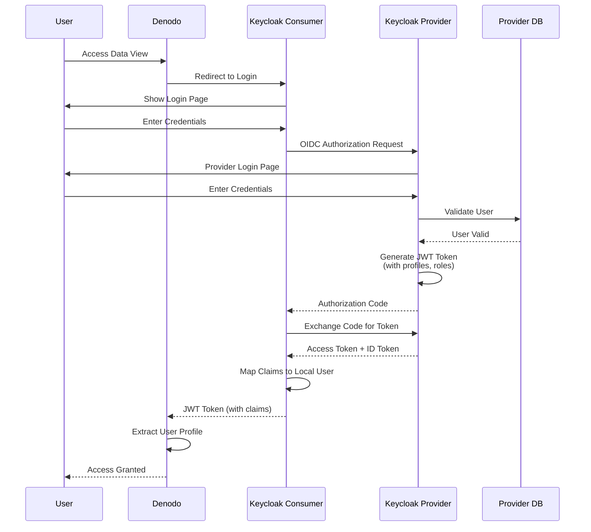
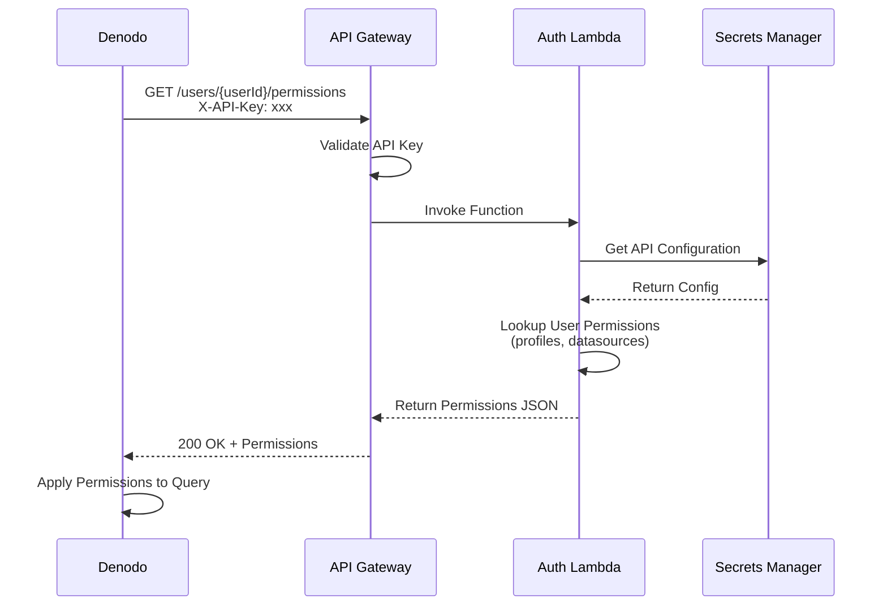
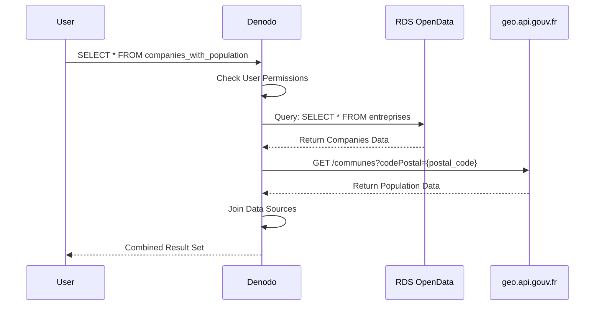

# Denodo POC - Keycloak Federation Architecture

**Date:** February 5, 2026  
**Region:** eu-west-3 (Paris)  
**VPC:** vpc-08ffb9d90f07533d0 (ADS VPC-vpc)  
**Account:** 928902064673

## Table of Contents
1. [Architecture Overview](#architecture-overview)
2. [Network Topology](#network-topology)
3. [Data Flow](#data-flow)
4. [Components](#components)
5. [Security](#security)
6. [Data Sources](#data-sources)

---

## Architecture Overview

This POC implements a federated identity system using two Keycloak instances with OIDC federation, integrated with Denodo for secure data virtualization access.

### High-Level Architecture

```mermaid
graph TB
    subgraph "VPC: vpc-08ffb9d90f07533d0 (eu-west-3)"
        subgraph "Public Subnets (AZ 3a, 3b)"
            ALB[Application Load Balancer<br/>keycloak-alb<br/>Port 80/443]
        end
        
        subgraph "Private Subnet - AZ 3c"
            DENODO[Denodo EC2<br/>i-0aef555dcb0ff873f<br/>10.0.75.195<br/>m5a.4xlarge]
        end
        
        subgraph "Private Subnets - ECS (AZ 3a, 3b)"
            KC_PROVIDER[Keycloak Provider<br/>ECS Fargate<br/>Container Port 8080<br/>CPU: 512, Memory: 1024MB]
            KC_CONSUMER[Keycloak Consumer<br/>ECS Fargate<br/>Container Port 8080<br/>CPU: 512, Memory: 1024MB]
        end
        
        subgraph "Private Subnets - Data Layer (AZ 3a, 3b)"
            RDS_KC_PROVIDER[(RDS PostgreSQL<br/>keycloak-provider-db<br/>db.t3.micro<br/>PostgreSQL 15)]
            RDS_KC_CONSUMER[(RDS PostgreSQL<br/>keycloak-consumer-db<br/>db.t3.micro<br/>PostgreSQL 15)]
            RDS_OPENDATA[(RDS PostgreSQL<br/>denodo-opendata-db<br/>db.t3.small<br/>PostgreSQL 15<br/>Schema: opendata)]
        end
        
        subgraph "Lambda & API Gateway"
            APIGW[API Gateway<br/>/api/v1/users/{userId}/permissions<br/>REST API]
            AUTH_API[Authorization API<br/>Lambda Function<br/>Runtime: Python 3.11<br/>Memory: 256MB]
        end
    end
    
    subgraph "External Data Sources"
        API_GEO[Public REST API<br/>geo.api.gouv.fr<br/>French Geographic Data]
        API_SIRENE[Public REST API<br/>entreprise.data.gouv.fr<br/>SIRENE Company Data]
    end
    
    subgraph "AWS Managed Services"
        SECRETS[AWS Secrets Manager<br/>- keycloak/provider/db<br/>- keycloak/consumer/db<br/>- denodo/opendata/db<br/>- api/auth/key]
        CW_LOGS[CloudWatch Logs<br/>- /ecs/keycloak-provider<br/>- /ecs/keycloak-consumer<br/>- /aws/lambda/auth-api]
        ECS_CLUSTER[ECS Cluster<br/>denodo-keycloak-cluster<br/>Launch Type: FARGATE]
    end
    
    %% Connections
    ALB -->|Route: /auth/realms/denodo-idp/*| KC_PROVIDER
    ALB -->|Route: /auth/realms/denodo-consumer/*| KC_CONSUMER
    KC_PROVIDER -->|JDBC Connection| RDS_KC_PROVIDER
    KC_CONSUMER -->|JDBC Connection| RDS_KC_CONSUMER
    KC_CONSUMER -.->|OIDC Federation<br/>Token Validation| KC_PROVIDER
    
    DENODO -->|1. Authenticate| KC_CONSUMER
    DENODO -->|2. Get Permissions| APIGW
    DENODO -->|3. Query Data Source 1| RDS_OPENDATA
    DENODO -->|4. Query Data Source 2| API_GEO
    DENODO -->|Optional Query| API_SIRENE
    
    APIGW --> AUTH_API
    AUTH_API -->|Read API Key| SECRETS
    KC_PROVIDER -->|Read DB Credentials| SECRETS
    KC_CONSUMER -->|Read DB Credentials| SECRETS
    
    KC_PROVIDER -->|Application Logs| CW_LOGS
    KC_CONSUMER -->|Application Logs| CW_LOGS
    AUTH_API -->|Function Logs| CW_LOGS
    
    ECS_CLUSTER -->|Manages| KC_PROVIDER
    ECS_CLUSTER -->|Manages| KC_CONSUMER

    style DENODO fill:#ff9999
    style KC_PROVIDER fill:#99ccff
    style KC_CONSUMER fill:#99ccff
    style RDS_OPENDATA fill:#99ff99
    style API_GEO fill:#ffff99
    style API_SIRENE fill:#ffff99
```

---

## Network Topology

### VPC Configuration

**VPC Details:**
- **VPC ID:** vpc-08ffb9d90f07533d0
- **CIDR:** 10.0.0.0/16 (assumed)
- **Region:** eu-west-3
- **DNS Hostnames:** Enabled
- **DNS Resolution:** Enabled

### Subnet Configuration

| Subnet Type | AZ | CIDR (example) | Purpose | Resources |
|-------------|----|---------

|---------|-----------|
| Public | eu-west-3a | 10.0.1.0/24 | ALB, NAT | Load Balancer |
| Public | eu-west-3b | 10.0.2.0/24 | ALB, NAT | Load Balancer |
| Private | eu-west-3a | 10.0.11.0/24 | ECS Tasks | Keycloak Containers |
| Private | eu-west-3b | 10.0.12.0/24 | ECS Tasks | Keycloak Containers |
| Private | eu-west-3c | 10.0.75.0/24 | EC2, RDS | Denodo, Databases |

### Security Groups

#### 1. ALB Security Group (`keycloak-alb-sg`)
```
Inbound:
- Port 80 (HTTP) from 0.0.0.0/0
- Port 443 (HTTPS) from 0.0.0.0/0

Outbound:
- Port 8080 to keycloak-ecs-sg (Keycloak tasks)
```

#### 2. Keycloak ECS Security Group (`keycloak-ecs-sg`)
```
Inbound:
- Port 8080 from keycloak-alb-sg
- Port 8080 from denodo-client-sg (Denodo EC2)

Outbound:
- Port 5432 to keycloak-rds-sg (PostgreSQL)
- Port 443 to 0.0.0.0/0 (OIDC endpoints, internet)
```

#### 3. Keycloak RDS Security Group (`keycloak-rds-sg`)
```
Inbound:
- Port 5432 from keycloak-ecs-sg

Outbound:
- None required
```

#### 4. Denodo Client Security Group (`denodo-client-sg`)
```
Inbound:
- Application-specific ports

Outbound:
- Port 8080 to keycloak-ecs-sg
- Port 5432 to opendata-rds-sg
- Port 443 to 0.0.0.0/0 (Public APIs)
```

#### 5. OpenData RDS Security Group (`opendata-rds-sg`)
```
Inbound:
- Port 5432 from denodo-client-sg

Outbound:
- None required
```

#### 6. Lambda Security Group (`lambda-auth-sg`)
```
Inbound:
- None (invoked via API Gateway)

Outbound:
- Port 443 to Secrets Manager endpoint
```

---

## Data Flow

### 1. Authentication Flow (OIDC Federation)



### 2. Authorization Flow



### 3. Data Query Flow



---

## Components

### 1. ECS Cluster

**Cluster Name:** `denodo-keycloak-cluster`

**Configuration:**
- **Launch Type:** FARGATE
- **Capacity Providers:** FARGATE, FARGATE_SPOT
- **Container Insights:** Enabled
- **Tags:**
  - Project: denodo-poc
  - Environment: dev
  - ManagedBy: cloudshell-script

### 2. Keycloak Provider (Détenteur)

**Service:** `keycloak-provider`

**Task Definition:**
```json
{
  "family": "keycloak-provider",
  "networkMode": "awsvpc",
  "requiresCompatibilities": ["FARGATE"],
  "cpu": "512",
  "memory": "1024",
  "taskRoleArn": "arn:aws:iam::928902064673:role/keycloak-task-role",
  "executionRoleArn": "arn:aws:iam::928902064673:role/keycloak-execution-role"
}
```

**Environment Variables:**
- `KC_DB=postgres`
- `KC_DB_URL_HOST=keycloak-provider-db.xxx.rds.amazonaws.com`
- `KC_DB_URL_DATABASE=keycloak_provider`
- `KC_DB_USERNAME=keycloak`
- `KC_HOSTNAME=keycloak-provider.denodo-poc.local`
- `KC_PROXY=edge`
- `KEYCLOAK_ADMIN=admin`

**Secrets:**
- `KC_DB_PASSWORD` → Secrets Manager
- `KEYCLOAK_ADMIN_PASSWORD` → Secrets Manager

**Realm Configuration:**
- **Realm Name:** `denodo-idp`
- **Display Name:** Denodo Identity Provider
- **Enabled:** true
- **User Registration:** false
- **Login Theme:** keycloak
- **Token Settings:**
  - Access Token Lifespan: 5 minutes
  - SSO Session Idle: 30 minutes
  - SSO Session Max: 10 hours

**Client Configuration:**
```json
{
  "clientId": "denodo-consumer",
  "protocol": "openid-connect",
  "publicClient": false,
  "redirectUris": [
    "https://keycloak-consumer.denodo-poc.local/auth/realms/denodo-consumer/broker/provider-idp/endpoint"
  ],
  "webOrigins": ["*"],
  "attributes": {
    "access.token.lifespan": "300"
  }
}
```

### 3. Keycloak Consumer (Consommateur)

**Service:** `keycloak-consumer`

**Task Definition:** Similar to Provider

**Realm Configuration:**
- **Realm Name:** `denodo-consumer`
- **Display Name:** Denodo Service Provider
- **Enabled:** true

**Identity Provider Configuration:**
```json
{
  "alias": "provider-idp",
  "displayName": "Denodo Identity Provider",
  "providerId": "oidc",
  "enabled": true,
  "config": {
    "authorizationUrl": "https://keycloak-provider.denodo-poc.local/auth/realms/denodo-idp/protocol/openid-connect/auth",
    "tokenUrl": "https://keycloak-provider.denodo-poc.local/auth/realms/denodo-idp/protocol/openid-connect/token",
    "userInfoUrl": "https://keycloak-provider.denodo-poc.local/auth/realms/denodo-idp/protocol/openid-connect/userinfo",
    "clientId": "denodo-consumer",
    "clientSecret": "${KEYCLOAK_CLIENT_SECRET}",
    "defaultScope": "openid profile email"
  }
}
```

### 4. RDS Databases

#### Keycloak Provider Database
```
Identifier: keycloak-provider-db
Engine: PostgreSQL 15.4
Instance Class: db.t3.micro
Storage: 20 GB GP3
Multi-AZ: false (POC)
Backup Retention: 7 days
Database Name: keycloak_provider
Username: keycloak
```

#### Keycloak Consumer Database
```
Identifier: keycloak-consumer-db
Engine: PostgreSQL 15.4
Instance Class: db.t3.micro
Storage: 20 GB GP3
Multi-AZ: false (POC)
Database Name: keycloak_consumer
Username: keycloak
```

#### OpenData Database
```
Identifier: denodo-opendata-db
Engine: PostgreSQL 15.4
Instance Class: db.t3.small
Storage: 50 GB GP3
Multi-AZ: false (POC)
Backup Retention: 7 days
Database Name: opendata
Schema: opendata
Username: denodo
```

### 5. Lambda Authorization API

**Function Name:** `denodo-permissions-api`

**Configuration:**
- **Runtime:** Python 3.11
- **Memory:** 256 MB
- **Timeout:** 30 seconds
- **Handler:** lambda_function.lambda_handler
- **Environment Variables:**
  - `SECRETS_ARN`: ARN of API configuration secret

**API Endpoint:**
```
GET /api/v1/users/{userId}/permissions
Headers:
  - X-API-Key: {api-key}
  
Response 200 OK:
{
  "userId": "analyst@denodo.com",
  "profiles": ["data-analyst"],
  "datasources": [
    {
      "id": "rds-opendata",
      "name": "French OpenData (SIRENE + Population)",
      "type": "postgresql",
      "permissions": ["read", "query"]
    },
    {
      "id": "api-geo",
      "name": "French Geographic API",
      "type": "rest-api",
      "permissions": ["read"]
    }
  ],
  "roles": ["viewer"]
}
```

### 6. Application Load Balancer

**Name:** `keycloak-alb`

**Configuration:**
- **Scheme:** internet-facing
- **IP Address Type:** ipv4
- **Subnets:** 2 public subnets (3a, 3b)
- **Security Group:** keycloak-alb-sg

**Listeners:**
- **Port 80 (HTTP):**
  - Default Action: Redirect to HTTPS
  
- **Port 443 (HTTPS):**
  - Certificate: ACM Certificate
  - Rules:
    - Path `/auth/realms/denodo-idp/*` → Target Group: keycloak-provider-tg
    - Path `/auth/realms/denodo-consumer/*` → Target Group: keycloak-consumer-tg

**Target Groups:**

1. **keycloak-provider-tg**
   - Protocol: HTTP
   - Port: 8080
   - Health Check: `/auth/realms/denodo-idp`
   - Deregistration Delay: 30 seconds

2. **keycloak-consumer-tg**
   - Protocol: HTTP
   - Port: 8080
   - Health Check: `/auth/realms/denodo-consumer`
   - Deregistration Delay: 30 seconds

---

## Security

### JWT Token Claims

**Standard Claims:**
```json
{
  "sub": "12345678-1234-1234-1234-123456789abc",
  "email": "analyst@denodo.com",
  "email_verified": true,
  "preferred_username": "analyst",
  "name": "Data Analyst",
  "given_name": "Data",
  "family_name": "Analyst"
}
```

**Custom Claims:**
```json
{
  "profiles": ["data-analyst"],
  "datasources": ["rds-opendata", "api-geo"],
  "permissions": {
    "rds-opendata": ["read", "query"],
    "api-geo": ["read"]
  },
  "department": "Analytics",
  "realm_access": {
    "roles": ["viewer"]
  }
}
```

### Test Users

#### 1. Data Analyst
```yaml
Username: analyst@denodo.com
Password: Analyst@2026!
Email: analyst@denodo.com
Profiles: [data-analyst]
Roles: [viewer]
Datasources: [rds-opendata, api-geo]
Permissions: [read, query]
```

#### 2. Data Scientist
```yaml
Username: scientist@denodo.com
Password: Scientist@2026!
Email: scientist@denodo.com
Profiles: [data-scientist]
Roles: [editor]
Datasources: [rds-opendata, api-geo, api-sirene]
Permissions: [read, query, export]
```

#### 3. Administrator
```yaml
Username: admin@denodo.com
Password: Admin@2026!
Email: admin@denodo.com
Profiles: [admin]
Roles: [admin]
Datasources: [*]
Permissions: [*]
```

### Secrets Management

All sensitive credentials stored in AWS Secrets Manager:

```json
{
  "keycloak/provider/db": {
    "username": "keycloak",
    "password": "<auto-generated>",
    "host": "keycloak-provider-db.xxx.rds.amazonaws.com",
    "port": 5432,
    "dbname": "keycloak_provider"
  },
  "keycloak/consumer/db": {
    "username": "keycloak",
    "password": "<auto-generated>",
    "host": "keycloak-consumer-db.xxx.rds.amazonaws.com",
    "port": 5432,
    "dbname": "keycloak_consumer"
  },
  "denodo/opendata/db": {
    "username": "denodo",
    "password": "<auto-generated>",
    "host": "denodo-opendata-db.xxx.rds.amazonaws.com",
    "port": 5432,
    "dbname": "opendata"
  },
  "keycloak/admin": {
    "username": "admin",
    "password": "<auto-generated>"
  },
  "keycloak/client-secret": {
    "clientId": "denodo-consumer",
    "clientSecret": "<auto-generated>"
  },
  "api/auth/key": {
    "apiKey": "<auto-generated>"
  }
}
```

---

## Data Sources

### Data Source 1: RDS OpenData (PostgreSQL)

#### Table 1: Entreprises (SIRENE Data)

```sql
CREATE TABLE opendata.entreprises (
    siren VARCHAR(9) PRIMARY KEY,
    nom_raison_sociale VARCHAR(255) NOT NULL,
    forme_juridique VARCHAR(100),
    forme_juridique_code VARCHAR(10),
    date_creation DATE,
    date_cessation DATE,
    adresse TEXT,
    numero_voie VARCHAR(10),
    type_voie VARCHAR(50),
    libelle_voie VARCHAR(255),
    code_postal VARCHAR(5),
    ville VARCHAR(100),
    code_commune VARCHAR(10),
    departement VARCHAR(3),
    region VARCHAR(3),
    code_naf VARCHAR(10),
    libelle_naf VARCHAR(255),
    effectif VARCHAR(50),
    tranche_effectif VARCHAR(10),
    statut VARCHAR(50),
    created_at TIMESTAMP DEFAULT CURRENT_TIMESTAMP,
    updated_at TIMESTAMP DEFAULT CURRENT_TIMESTAMP
);

CREATE INDEX idx_entreprises_postal ON opendata.entreprises(code_postal);
CREATE INDEX idx_entreprises_ville ON opendata.entreprises(ville);
CREATE INDEX idx_entreprises_dept ON opendata.entreprises(departement);
CREATE INDEX idx_entreprises_naf ON opendata.entreprises(code_naf);
```

**Sample Data (15,000 companies):**
- Sectors: Technology, Retail, Manufacturing, Services
- Regions: Île-de-France (75), PACA (13), Auvergne-Rhône-Alpes (69)
- Effectifs: From micro-enterprises to large companies

#### Table 2: Population Communes

```sql
CREATE TABLE opendata.population_communes (
    code_commune VARCHAR(10) PRIMARY KEY,
    nom_commune VARCHAR(100) NOT NULL,
    code_postal VARCHAR(5),
    code_departement VARCHAR(3),
    nom_departement VARCHAR(100),
    code_region VARCHAR(3),
    nom_region VARCHAR(100),
    population INTEGER,
    population_municipale INTEGER,
    population_totale INTEGER,
    densite DECIMAL(10,2),
    superficie DECIMAL(10,2),
    annee INTEGER DEFAULT 2023,
    created_at TIMESTAMP DEFAULT CURRENT_TIMESTAMP
);

CREATE INDEX idx_population_postal ON opendata.population_communes(code_postal);
CREATE INDEX idx_population_dept ON opendata.population_communes(code_departement);
```

**Sample Data (36,000 communes):**
- All French communes with 2023 population data
- Includes overseas territories
- Density and surface area calculations

#### View: Companies with Population

```sql
CREATE VIEW opendata.entreprises_population AS
SELECT 
    e.siren,
    e.nom_raison_sociale,
    e.forme_juridique,
    e.ville,
    e.code_postal,
    e.departement,
    e.code_naf,
    e.libelle_naf,
    e.effectif,
    p.nom_commune,
    p.population,
    p.densite,
    CASE 
        WHEN p.population < 2000 THEN 'Petite commune'
        WHEN p.population < 10000 THEN 'Commune moyenne'
        WHEN p.population < 50000 THEN 'Grande commune'
        ELSE 'Très grande ville'
    END as categorie_commune
FROM opendata.entreprises e
LEFT JOIN opendata.population_communes p 
    ON e.code_postal = p.code_postal
WHERE e.statut = 'Actif';
```

### Data Source 2: French Geographic API (geo.api.gouv.fr)

**Base URL:** `https://geo.api.gouv.fr`

**Endpoints:**

1. **Get Commune by Postal Code**
   ```
   GET /communes?codePostal={code}
   
   Response:
   [
     {
       "nom": "Paris 1er Arrondissement",
       "code": "75101",
       "codeDepartement": "75",
       "codeRegion": "11",
       "codesPostaux": ["75001"],
       "population": 16888
     }
   ]
   ```

2. **Get Department**
   ```
   GET /departements/{code}
   
   Response:
   {
     "nom": "Paris",
     "code": "75",
     "codeRegion": "11",
     "region": {
       "nom": "Île-de-France",
       "code": "11"
     }
   }
   ```

3. **Get Region**
   ```
   GET /regions/{code}
   
   Response:
   {
     "nom": "Île-de-France",
     "code": "11"
   }
   ```

**Denodo Configuration:**
```json
{
  "dataSourceName": "API_GEO_GOUV",
  "type": "JSON",
  "route": {
    "baseURL": "https://geo.api.gouv.fr",
    "endpoints": [
      {
        "name": "communes_by_postal",
        "path": "/communes",
        "method": "GET",
        "parameters": ["codePostal"]
      },
      {
        "name": "departement",
        "path": "/departements/@code",
        "method": "GET"
      },
      {
        "name": "region",
        "path": "/regions/@code",
        "method": "GET"
      }
    ]
  }
}
```

### Example Denodo Join Query

```sql
-- Companies in Paris with population data from both sources
SELECT 
    rds.siren,
    rds.nom_raison_sociale,
    rds.code_postal,
    rds.ville,
    rds.effectif,
    rds.population as rds_population,
    api.nom as api_commune_name,
    api.population as api_population,
    api.codeDepartement,
    api.codeRegion
FROM 
    rds_opendata.entreprises_population rds
LEFT JOIN 
    api_geo.communes api ON rds.code_postal = api.codesPostaux
WHERE 
    rds.departement = '75'
    AND rds.statut = 'Actif'
ORDER BY 
    api.population DESC
LIMIT 100;
```

---

## Resource Summary

### AWS Resources Created

| Resource Type | Count | Names | Purpose |
|---------------|-------|-------|---------|
| ECS Cluster | 1 | denodo-keycloak-cluster | Container orchestration |
| ECS Service | 2 | keycloak-provider, keycloak-consumer | Keycloak instances |
| RDS Instance | 3 | keycloak-provider-db, keycloak-consumer-db, denodo-opendata-db | Databases |
| Load Balancer | 1 | keycloak-alb | Traffic distribution |
| Target Group | 2 | keycloak-provider-tg, keycloak-consumer-tg | ECS task targets |
| Security Group | 6 | alb-sg, ecs-sg, rds-sg, denodo-sg, opendata-rds-sg, lambda-sg | Network security |
| Lambda Function | 1 | denodo-permissions-api | Authorization API |
| API Gateway | 1 | denodo-auth-api | API endpoint |
| Secrets | 6 | Various credentials | Secure credential storage |
| CloudWatch Log Groups | 3 | ECS and Lambda logs | Centralized logging |

### Cost Estimation (Monthly)

| Service | Configuration | Estimated Cost |
|---------|---------------|----------------|
| ECS Fargate | 2 tasks × 0.5 vCPU, 1GB RAM × 730 hrs | $35 |
| RDS PostgreSQL | 3 × db.t3.micro/small | $65 |
| Application Load Balancer | 1 ALB | $22 |
| Data Transfer | ~10 GB/month | $1 |
| Lambda | 100,000 requests/month | <$1 |
| API Gateway | 100,000 requests/month | $1 |
| Secrets Manager | 6 secrets | $3 |
| CloudWatch Logs | 5 GB/month | $3 |
| **Total** | | **~$130/month** |

---

## Deployment Steps

1. **Prerequisites:** AWS CLI configured, CloudShell access
2. **Execute:** `./scripts/deploy-denodo-keycloak.sh`
3. **Duration:** ~30-45 minutes
4. **Validation:** Run test scripts in `/tests`
5. **Configuration:** Access Keycloak admin consoles
6. **Integration:** Configure Denodo data sources

---

## Support & Troubleshooting

### Common Issues

1. **Keycloak not accessible**
   - Check ALB health checks
   - Verify security group rules
   - Check ECS task logs in CloudWatch

2. **OIDC Federation failing**
   - Verify client secret matches
   - Check redirect URIs configuration
   - Review token endpoint URLs

3. **Database connection errors**
   - Confirm RDS security group allows ECS
   - Verify credentials in Secrets Manager
   - Check RDS endpoint resolution

### Useful Commands

```bash
# Check ECS services
aws ecs describe-services --cluster denodo-keycloak-cluster --services keycloak-provider keycloak-consumer --region eu-west-3

# Check RDS status
aws rds describe-db-instances --region eu-west-3 --query 'DBInstances[?contains(DBInstanceIdentifier, `keycloak`) || contains(DBInstanceIdentifier, `denodo`)].{ID:DBInstanceIdentifier,Status:DBInstanceStatus}'

# View logs
aws logs tail /ecs/keycloak-provider --follow --region eu-west-3

# Test API
curl -H "X-API-Key: YOUR_KEY" https://your-api-gateway-url/api/v1/users/analyst@denodo.com/permissions
```

---

**Document Version:** 1.0  
**Last Updated:** February 5, 2026  
**Author:** Jaafar Benabderrazak  
**Status:** Ready for Deployment
