# Denodo Keycloak POC -- Deployment Status

**Date:** 12 February 2026
**Region:** eu-west-3 (Paris)
**Account:** 928902064673
**Author:** Jaafar Benabderrazak

> **📋 Document Purpose:**
> This document describes the **actual deployed architecture** of the Denodo Keycloak POC, including implementation decisions and workarounds made during deployment. Some aspects differ from the original architecture plan (see [DENODO_KEYCLOAK_ARCHITECTURE.md](./DENODO_KEYCLOAK_ARCHITECTURE.md)) due to deployment constraints, cost optimization, and POC simplification.

---

## Deployment Progress

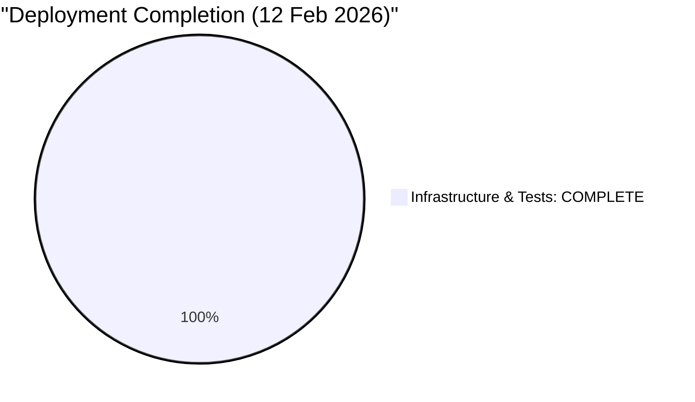

**Status:** All 28 automated tests passed. Infrastructure is 100% operational and ready for Denodo platform integration.

---

## 1. Overall Architecture (As Deployed)

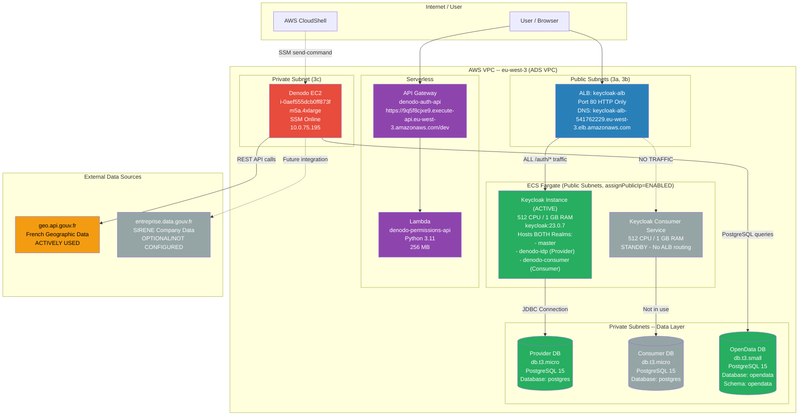

> **Important Deployment Details:**
> - **Single Keycloak Instance:** Both realms (`denodo-idp` and `denodo-consumer`) run on the same Keycloak Provider ECS task
> - **ALB Routing:** ALL traffic routes to Provider target group; Consumer service is standby only
> - **Network Configuration:** ECS tasks deployed in PUBLIC subnets with assignPublicIp=ENABLED (no NAT Gateway)
> - **Protocol:** HTTP only (Port 80), sslRequired=NONE due to no ACM certificate
> - **Database Names:** Using default `postgres` database (not custom database names)
> - **OIDC Federation:** Internal federation between denodo-consumer realm → denodo-idp realm on same instance

---

## 2. Deployed AWS Resources

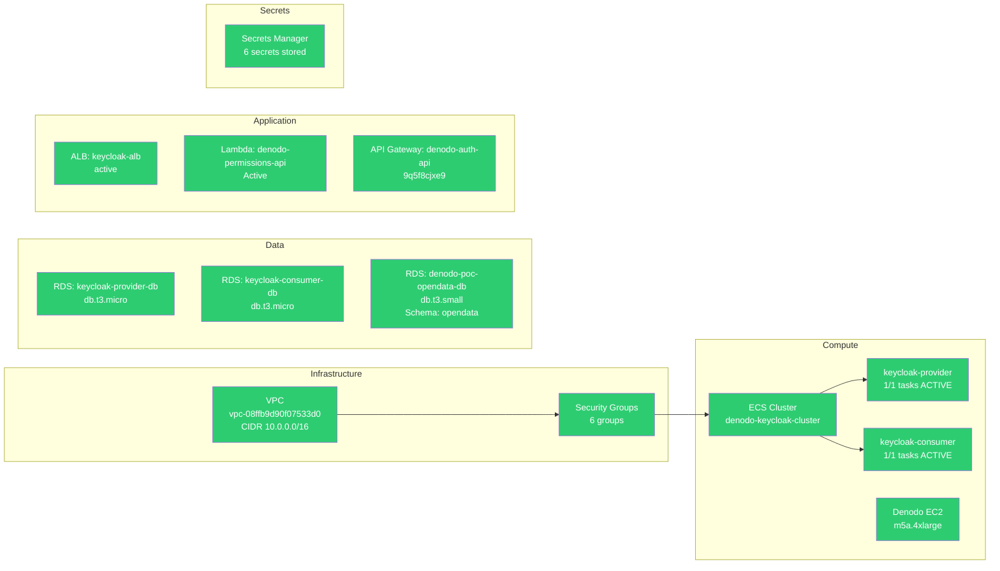

| Component | Resource | Status | Identifier / Endpoint | Notes |
|-----------|----------|--------|----------------------|-------|
| **VPC** | ADS VPC | Active | `vpc-08ffb9d90f07533d0` (CIDR 10.0.0.0/16) | Existing VPC |
| **ECS Cluster** | denodo-keycloak-cluster | Active | Fargate launch type | 2 services |
| **ECS Service** | keycloak-provider | 1/1 tasks | ACTIVE | Hosts all 3 Keycloak realms, receives ALL ALB traffic |
| **ECS Service** | keycloak-consumer | 1/1 tasks | STANDBY | Running but not receiving traffic |
| **RDS** | keycloak-provider-db | Available | db.t3.micro, PostgreSQL 15 | Database: `postgres` (not custom name) |
| **RDS** | keycloak-consumer-db | Available | db.t3.micro, PostgreSQL 15 | Database: `postgres`, not actively used |
| **RDS** | denodo-poc-opendata-db | Available | db.t3.small, PostgreSQL 15 | Database: `opendata`, Schema: `opendata` |
| **ALB** | keycloak-alb | Active | `keycloak-alb-541762229.eu-west-3.elb.amazonaws.com` | HTTP only (Port 80), no HTTPS |
| **Lambda** | denodo-permissions-api | Active | Python 3.11, 256 MB | Role-based access control API |
| **API Gateway** | denodo-auth-api | Deployed | `https://9q5f8cjxe9.execute-api.eu-west-3.amazonaws.com/dev` | Requires X-API-Key header |
| **Secrets** | 6 secrets | Stored | Keycloak admin, DB passwords, client secret, API key | All in Secrets Manager |
| **Denodo EC2** | i-0aef555dcb0ff873f | Running | m5a.4xlarge, SSM Online, 10.0.75.195 | Used for RDS access via SSM |

---

## 3. ALB Routing Rules

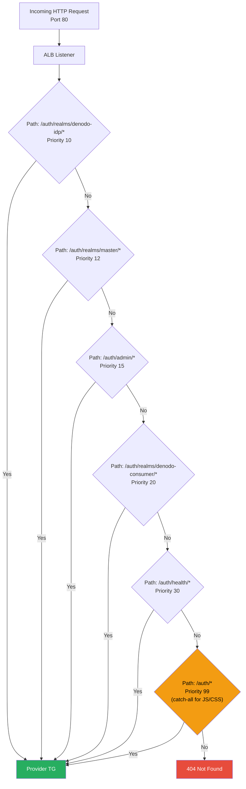

> The **Priority 99 catch-all** rule was added to fix the Keycloak admin UI "Loading" issue by ensuring static assets (JS, CSS, images) under `/auth/*` are forwarded to the Provider target group.

---

## 4. Keycloak Configuration

### Realms and Federation

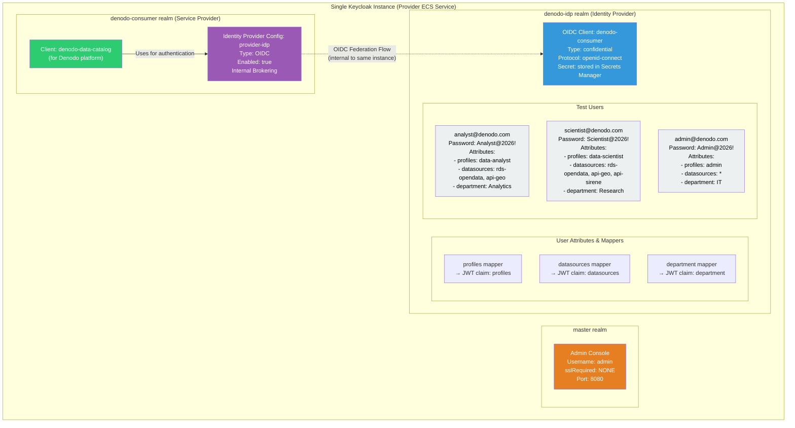

> **Key Configuration Details:**
> - All three realms (master, denodo-idp, denodo-consumer) run on a **single Keycloak instance**
> - The federation is **internal**: consumer realm → provider realm on same server
> - JWT tokens include custom claims (profiles, datasources, department) via attribute mappers
> - HTTP only (Port 80) - sslRequired disabled on all realms for POC
> - Consumer ECS service exists but is not used (all traffic goes to Provider service)

### OIDC Federation Flow

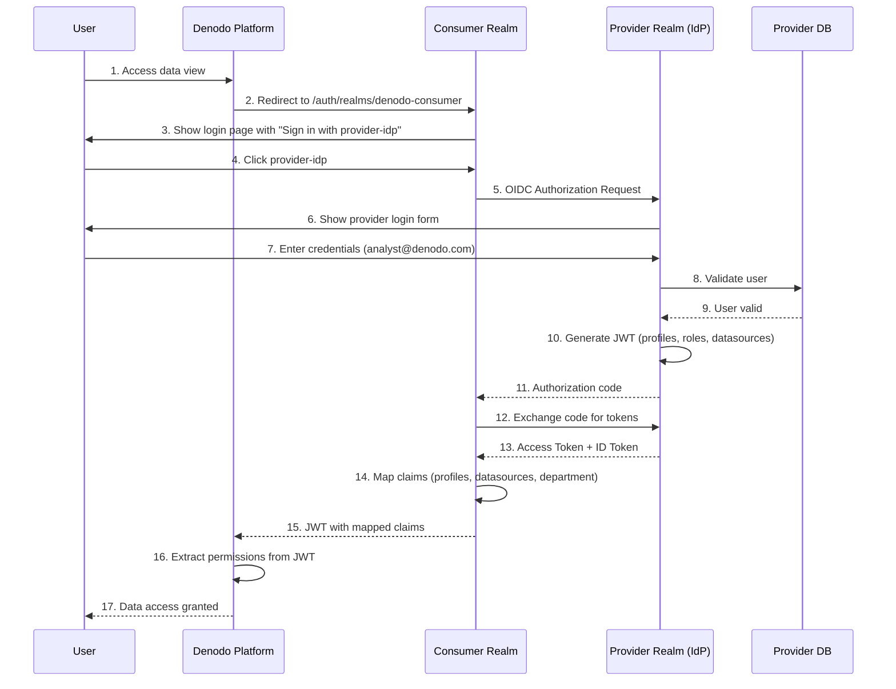

### Authorization API Flow

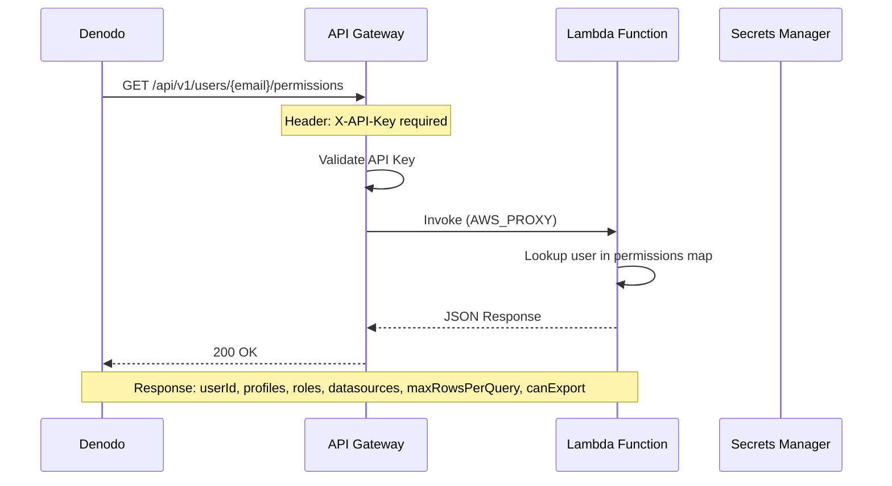

---

## 5. Test Users and Permissions

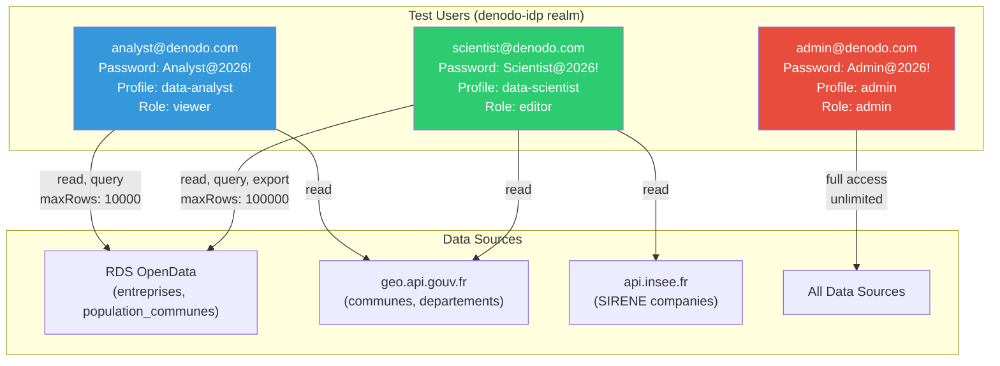

| User | Password | Profile | Datasources | Max Rows | Export | Notes |
|------|----------|---------|-------------|----------|--------|-------|
| analyst@denodo.com | Analyst@2026! | data-analyst | rds-opendata, api-geo | 10,000 | No | Read-only access |
| scientist@denodo.com | Scientist@2026! | data-scientist | rds-opendata, api-geo | 100,000 | Yes | Advanced access, export enabled |
| admin@denodo.com | Admin@2026! | admin | all (*) | unlimited | Yes | Full administrative access |

> **Note:** While the scientist user's attributes may reference `api-sirene`, this datasource is **not actively configured** in the current deployment. The POC focuses on `rds-opendata` and `api-geo` (geo.api.gouv.fr) as the primary data sources.

---

## 6. Issues Resolved During Deployment

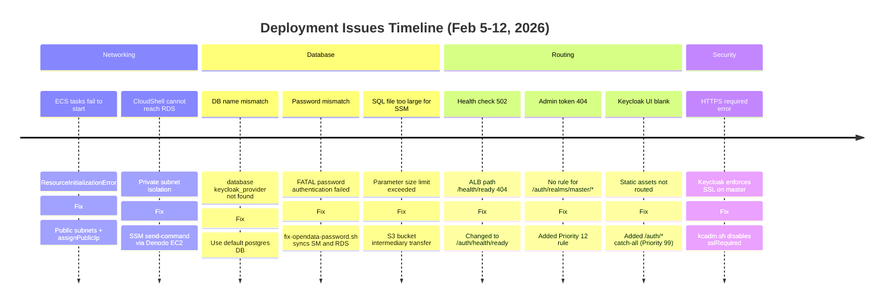

| # | Issue | Root Cause | Fix |
|---|-------|-----------|-----|
| 1 | ECS tasks fail to start | Private subnets, no NAT Gateway | Public subnets + assignPublicIp=ENABLED |
| 2 | CloudShell cannot reach private RDS | VPC isolation | SSM send-command routed through Denodo EC2 |
| 3 | DB name mismatch | Custom DB names not created | Use default `postgres` database |
| 4 | RDS password mismatch | Secrets Manager out of sync | `fix-opendata-password.sh` re-syncs |
| 5 | SQL file too large for SSM | SSM parameter size limit | S3 bucket as intermediary |
| 6 | Health check 502 | ALB health path wrong | Updated to `/auth/health/ready` |
| 7 | Admin token 404 | No ALB rule for master realm | Added `/auth/realms/master/*` (Priority 12) |
| 8 | Keycloak UI "Loading" | Static assets not forwarded | Added `/auth/*` catch-all (Priority 99) |
| 9 | HTTPS required error | Default SSL policy | `kcadm.sh` disables sslRequired at startup |

---

## 7. What Has Been Deployed (Complete)

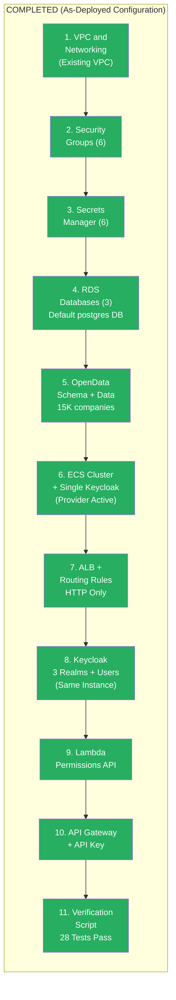

**All infrastructure and application components are deployed and operational.**

---

## 8. What's Next -- Denodo Integration

**All AWS infrastructure is deployed and verified.** The next phase is Denodo platform configuration.

See **[NEXT_STEPS.md](./NEXT_STEPS.md)** for detailed instructions.

```mermaid
flowchart LR
    subgraph "Phase 1: Denodo Configuration (Week 1)"
        D1["1.1 Configure OIDC\nAuthentication"]
        D2["1.2 Create RDS\nData Source"]
        D3["1.3 Create REST API\nData Source"]
        D4["1.4 Configure\nAuthorization API"]
        D5["1.5 Create\nDerived Views"]
    end

    subgraph "Phase 2: Testing (Week 1-2)"
        T1["2.1 Test User\nScenarios"]
        T2["2.2 Run Automated\nTest Suite"]
    end

    subgraph "Phase 3: Production Hardening (Week 2-3)"
        P1["3.1 Add HTTPS\n(ACM)"]
        P2["3.2 Add NAT\nGateway"]
        P3["3.3 Add WAF"]
        P4["3.4 Monitoring &\nAlerts"]
    end

    D1 --> D2 --> D3 --> D4 --> D5
    D5 --> T1 --> T2
    T2 --> P1 --> P2 --> P3 --> P4

    style D1 fill:#f39c12,color:#000
    style D2 fill:#f39c12,color:#000
    style D3 fill:#f39c12,color:#000
    style D4 fill:#f39c12,color:#000
    style D5 fill:#f39c12,color:#000
    style T1 fill:#e74c3c,color:#fff
    style T2 fill:#e74c3c,color:#fff
    style P1 fill:#95a5a6,color:#fff
    style P2 fill:#95a5a6,color:#fff
    style P3 fill:#95a5a6,color:#fff
    style P4 fill:#95a5a6,color:#fff
```

### Quick Start: Phase 1 (Denodo Configuration)

**Step 1: Configure OIDC Authentication**

In Denodo Admin Tool > Server Configuration > Authentication:

| Parameter | Value |
|-----------|-------|
| Issuer URL | `http://keycloak-alb-541762229.eu-west-3.elb.amazonaws.com/auth/realms/denodo-consumer` |
| Client ID | `denodo-consumer` |
| Client Secret | Get from Secrets Manager: `denodo-poc/keycloak/client-secret` |
| Scopes | `openid email profile` |

**Step 2: Create RDS Data Source**

| Parameter | Value |
|-----------|-------|
| Type | PostgreSQL (JDBC) |
| Host | `denodo-poc-opendata-db.cacjdkje8yxa.eu-west-3.rds.amazonaws.com` |
| Port | `5432` |
| Database | `opendata` |
| Schema | `opendata` |
| User | `denodo` |
| Password | Get from Secrets Manager: `denodo-poc/opendata/db` |

Import tables: `entreprises`, `population_communes`, `entreprises_population`

**Step 3: Create REST API Data Source**

| Parameter | Value |
|-----------|-------|
| Type | JSON/REST |
| Base URL | `https://geo.api.gouv.fr` |
| Auth | None (public) |

Create base views for: `/communes`, `/departements`, `/regions`

**Step 4: Test End-to-End**

1. Login via OIDC (redirects to Keycloak)
2. Enter `analyst@denodo.com` / `Analyst@2026!`
3. Run query: `SELECT * FROM opendata.entreprises WHERE departement = '75' LIMIT 10`
4. Verify row limit enforcement (10,000 rows for analyst)

**Detailed instructions:** See [NEXT_STEPS.md](./NEXT_STEPS.md)

---

## 9. Optional Improvements (Post-POC)

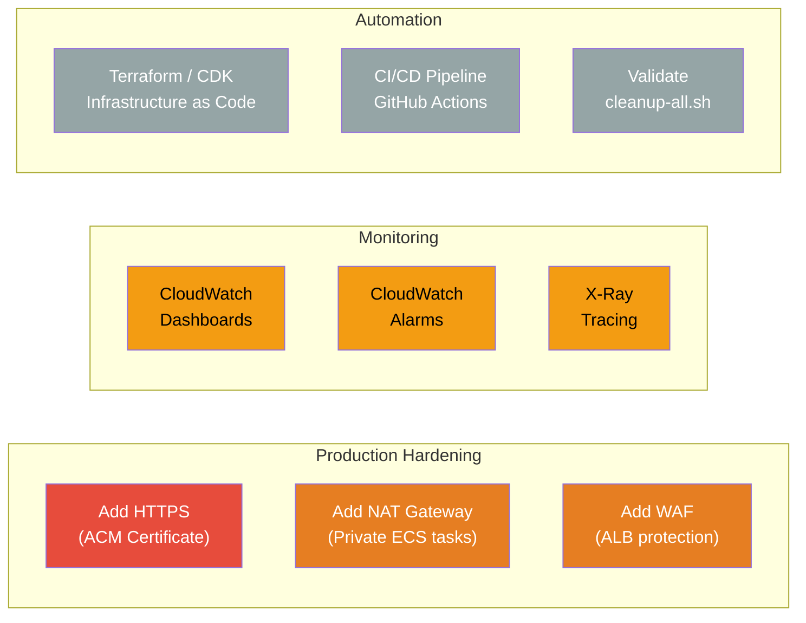

| Priority | Task | Description |
|----------|------|-------------|
| High | HTTPS (ACM) | Eliminates `sslRequired=NONE` workaround |
| High | NAT Gateway | Move ECS to private subnets (security) |
| Medium | WAF | Protect ALB from malicious traffic |
| Medium | CloudWatch Dashboards | Centralized monitoring |
| Medium | Alarms | Alert on unhealthy targets, 5xx errors |
| Low | Terraform/CDK | Reproducible infrastructure |
| Low | CI/CD | Automated deployment pipeline |
| Low | Cleanup validation | Test `scripts/cleanup-all.sh` end-to-end |

---

## 10. Access URLs and Credentials

| Service | URL | Credentials |
|---------|-----|-------------|
| **Keycloak Admin** | http://keycloak-alb-541762229.eu-west-3.elb.amazonaws.com/auth/admin | admin / (Secrets Manager) |
| **Provider Realm** | http://keycloak-alb-541762229.eu-west-3.elb.amazonaws.com/auth/realms/denodo-idp | -- |
| **Consumer Realm** | http://keycloak-alb-541762229.eu-west-3.elb.amazonaws.com/auth/realms/denodo-consumer | -- |
| **OIDC Discovery** | http://keycloak-alb-541762229.eu-west-3.elb.amazonaws.com/auth/realms/denodo-consumer/.well-known/openid-configuration | -- |
| **Health Check** | http://keycloak-alb-541762229.eu-west-3.elb.amazonaws.com/auth/health/ready | -- |
| **Permissions API** | https://9q5f8cjxe9.execute-api.eu-west-3.amazonaws.com/dev/api/v1/users/{email}/permissions | X-API-Key header |
| **Federation Test** | http://keycloak-alb-541762229.eu-west-3.elb.amazonaws.com/auth/realms/denodo-consumer/account | Test users above |

---

## 11. Scripts Reference

| Script | Purpose | When to Run |
|--------|---------|-------------|
| `scripts/complete-setup.sh` | Fix ALB, deploy API Gateway, verify all components | After initial deployment |
| `scripts/verify-all.sh` | Full automated test suite (6 test categories) | Before Denodo integration |
| `scripts/deploy-denodo-keycloak.sh` | Deploy base infrastructure (VPC, RDS, Secrets) | Initial deployment |
| `scripts/deploy-ecs-keycloak.sh` | Deploy ECS cluster, services, ALB | After infrastructure |
| `scripts/configure-keycloak.sh` | Create realms, users, OIDC federation | After ECS is healthy |
| `scripts/deploy-lambda-api.sh` | Deploy Lambda + API Gateway | After Keycloak config |
| `scripts/load-opendata.sh` | Load French OpenData into RDS | After RDS is available |
| `scripts/diagnose-rds.sh` | Debug RDS connectivity issues | Troubleshooting |
| `scripts/check-deployment-status.sh` | Quick status of all components | Anytime |
| `scripts/cleanup-all.sh` | Delete all AWS resources | When done with POC |
| `scripts/fix-lambda-api.sh` | Clean up duplicate APIs, redeploy Lambda | If API returns 500 |
| `tests/test-all.sh` | Run all test suites | Validation |

---

## 12. Retrieving Secrets via CloudShell

All credentials are stored in AWS Secrets Manager. Use these commands from CloudShell.

### Keycloak Admin Password

```bash
aws secretsmanager get-secret-value \
  --secret-id denodo-poc/keycloak/admin \
  --region eu-west-3 \
  --query SecretString --output text | jq -r '.password'
```

### OpenData RDS Credentials

```bash
aws secretsmanager get-secret-value \
  --secret-id denodo-poc/opendata/db \
  --region eu-west-3 \
  --query SecretString --output text | jq '.'
```

Returns:

```json
{
  "username": "denodo",
  "password": "...",
  "host": "denodo-poc-opendata-db.cacjdkje8yxa.eu-west-3.rds.amazonaws.com",
  "port": 5432,
  "dbname": "opendata"
}
```

### Keycloak OIDC Client Secret

```bash
aws secretsmanager get-secret-value \
  --secret-id denodo-poc/keycloak/client-secret \
  --region eu-west-3 \
  --query SecretString --output text | jq '.'
```

### Authorization API Key

```bash
aws secretsmanager get-secret-value \
  --secret-id denodo-poc/api/auth-key \
  --region eu-west-3 \
  --query SecretString --output text | jq -r '.apiKey'
```

### List All POC Secrets

```bash
aws secretsmanager list-secrets \
  --region eu-west-3 \
  --filters Key=name,Values=denodo-poc \
  --query 'SecretList[].Name' --output table
```

### One-Liner: Export All Credentials

```bash
export KC_ADMIN_PWD=$(aws secretsmanager get-secret-value --secret-id denodo-poc/keycloak/admin --region eu-west-3 --query SecretString --output text | jq -r '.password')
export DB_PASSWORD=$(aws secretsmanager get-secret-value --secret-id denodo-poc/opendata/db --region eu-west-3 --query SecretString --output text | jq -r '.password')
export CLIENT_SECRET=$(aws secretsmanager get-secret-value --secret-id denodo-poc/keycloak/client-secret --region eu-west-3 --query SecretString --output text | jq -r '.clientSecret')
export API_KEY=$(aws secretsmanager get-secret-value --secret-id denodo-poc/api/auth-key --region eu-west-3 --query SecretString --output text | jq -r '.apiKey')

echo "Keycloak admin:     $KC_ADMIN_PWD"
echo "OpenData DB:        $DB_PASSWORD"
echo "OIDC client secret: $CLIENT_SECRET"
echo "API key:            $API_KEY"
```

---

**Document Version:** 2.1
**Last Updated:** 12 February 2026
**Status:** Infrastructure 100% deployed -- awaiting Denodo platform integration
