# Denodo Keycloak POC — Deployment Status

**Date:** 10 February 2026  
**Region:** eu-west-3 (Paris)  
**Account:** 928902064673  
**Author:** Jaafar Benabderrazak

---

## Deployment Overview


---

## 1. What Has Been Deployed ✅

### Infrastructure Pipeline

```mermaid
flowchart LR
    A["1. VPC & Networking\n✅ Deployed"] --> B["2. RDS Databases\n✅ Deployed"]
    B --> C["3. Secrets Manager\n✅ Deployed"]
    C --> D["4. ECS Cluster & Tasks\n✅ Deployed"]
    D --> E["5. ALB & Routing\n✅ Deployed"]
    E --> F["6. Keycloak Config\n✅ Deployed"]
    F --> G["7. Lambda API\n✅ Deployed"]
    G --> H["8. Automated Tests\n✅ Running"]

    style A fill:#2ecc71,color:#fff
    style B fill:#2ecc71,color:#fff
    style C fill:#2ecc71,color:#fff
    style D fill:#2ecc71,color:#fff
    style E fill:#2ecc71,color:#fff
    style F fill:#2ecc71,color:#fff
    style G fill:#2ecc71,color:#fff
    style H fill:#f39c12,color:#fff
```



### Deployed AWS Resources

| Component | Resource | Status | Endpoint / Identifier |
|-----------|----------|--------|----------------------|
| **VPC** | vpc-08ffb9d90f07533d0 | ✅ Active | CIDR 10.0.0.0/16 |
| **ECS Cluster** | denodo-keycloak-cluster | ✅ Running | Fargate |
| **ECS Service (Provider)** | keycloak-provider | ✅ Healthy | 1 task running |
| **ECS Service (Consumer)** | keycloak-consumer | ⚠️ Recreating | No ALB attachment needed |
| **RDS (Provider)** | keycloak-provider-db | ✅ Available | PostgreSQL 15 |
| **RDS (Consumer)** | keycloak-consumer-db | ✅ Available | PostgreSQL 15 |
| **RDS (OpenData)** | denodo-opendata-db | ✅ Available | PostgreSQL 15 |
| **ALB** | keycloak-alb | ✅ Active | `keycloak-alb-541762229.eu-west-3.elb.amazonaws.com` |
| **Lambda** | denodo-permissions-api | ✅ Active | Python 3.11 |
| **API Gateway** | denodo-auth-api | ✅ Active | `d53199bvse.execute-api.eu-west-3.amazonaws.com` |
| **Secrets Manager** | 6 secrets | ✅ Stored | All credentials managed |
| **Denodo EC2** | i-0aef555dcb0ff873f | ✅ Running | m5a.4xlarge, SSM online |

---

## 2. Architecture As Deployed

### Live Infrastructure

```mermaid
graph TB
    subgraph "Internet"
        USER["👤 User / CloudShell"]
    end

    subgraph "AWS VPC — eu-west-3"
        subgraph "Public Subnets (3a, 3b)"
            ALB["🔀 ALB<br/>keycloak-alb<br/>Port 80 HTTP"]
        end

        subgraph "Public Subnets — ECS Fargate"
            KC_PROV["🔑 Keycloak Provider<br/>512 CPU / 1GB RAM<br/>Image: keycloak:23.0.7<br/>Context: /auth<br/>assignPublicIp=ENABLED"]
            KC_CONS["🔑 Keycloak Consumer<br/>512 CPU / 1GB RAM<br/>(standby, no ALB)"]
        end

        subgraph "Private Subnets — Data Layer"
            RDS_P[("🗄 Provider DB<br/>db.t3.micro<br/>database: postgres")]
            RDS_C[("🗄 Consumer DB<br/>db.t3.micro<br/>database: postgres")]
            RDS_O[("🗄 OpenData DB<br/>db.t3.small<br/>database: opendata")]
        end

        subgraph "Serverless"
            APIGW["🌐 API Gateway<br/>REST API + API Key"]
            LAMBDA["⚡ Lambda<br/>permissions_api.py<br/>Python 3.11"]
        end

        subgraph "Private Subnet (3c)"
            DENODO["🖥 Denodo EC2<br/>i-0aef555dcb0ff873f<br/>m5a.4xlarge"]
        end
    end

    subgraph "External APIs"
        GEO["🌍 geo.api.gouv.fr"]
        INSEE["📊 api.insee.fr"]
    end

    USER --> ALB
    USER --> APIGW

    ALB -->|"/auth/realms/denodo-idp/*"<br/>Priority 10| KC_PROV
    ALB -->|"/auth/realms/master/*"<br/>Priority 12| KC_PROV
    ALB -->|"/auth/admin/*"<br/>Priority 15| KC_PROV
    ALB -->|"/auth/realms/denodo-consumer/*"<br/>Priority 20| KC_PROV
    ALB -->|"/auth/health/*"<br/>Priority 30| KC_PROV

    KC_PROV --> RDS_P
    KC_CONS --> RDS_C
    DENODO --> RDS_O
    DENODO --> GEO
    DENODO -.-> INSEE

    APIGW --> LAMBDA

    style KC_PROV fill:#27ae60,color:#fff
    style KC_CONS fill:#95a5a6,color:#fff
    style ALB fill:#2980b9,color:#fff
    style LAMBDA fill:#8e44ad,color:#fff
    style APIGW fill:#8e44ad,color:#fff
    style DENODO fill:#e74c3c,color:#fff
```



### ALB Routing Rules (Current)

```mermaid
flowchart TD
    REQ["Incoming HTTP Request"] --> LISTENER["Port 80 Listener"]

    LISTENER --> R1{"Path matches<br/>/auth/realms/denodo-idp/*?"}
    R1 -->|Yes, Priority 10| PROV_TG["Provider TG ✅"]
    R1 -->|No| R15{"Path matches<br/>/auth/realms/master/*?"}

    R15 -->|Yes, Priority 12| PROV_TG
    R15 -->|No| R2{"Path matches<br/>/auth/admin/*?"}

    R2 -->|Yes, Priority 15| PROV_TG
    R2 -->|No| R3{"Path matches<br/>/auth/realms/denodo-consumer/*?"}

    R3 -->|Yes, Priority 20| PROV_TG
    R3 -->|No| R4{"Path matches<br/>/auth/health/*?"}

    R4 -->|Yes, Priority 30| PROV_TG
    R4 -->|No| DEFAULT["404 Not Found"]

    style PROV_TG fill:#27ae60,color:#fff
    style DEFAULT fill:#e74c3c,color:#fff
```



> **Note:** All traffic routes to the **Provider** target group. Both realms (`denodo-idp` and `denodo-consumer`) are hosted on the same Keycloak instance. The Consumer ECS service runs as a standby without ALB attachment.

---

## 3. Keycloak Configuration

### Realms & Users (on Provider Instance)

```mermaid
graph LR
    subgraph "Keycloak Provider Instance"
        MASTER["👑 master realm<br/>sslRequired=NONE<br/>Admin: admin"]

        subgraph "denodo-idp realm"
            CLIENT_IDP["Client: denodo-consumer<br/>Type: confidential<br/>Protocol: OIDC"]
            U1["👤 analyst@denodo.com<br/>Profile: data-analyst<br/>Role: viewer"]
            U2["👤 scientist@denodo.com<br/>Profile: data-scientist<br/>Role: editor"]
            U3["👤 admin@denodo.com<br/>Profile: admin<br/>Role: admin"]
        end

        subgraph "denodo-consumer realm"
            IDP_BROKER["Identity Provider<br/>alias: provider-idp<br/>Type: OIDC<br/>→ denodo-idp"]
        end
    end

    IDP_BROKER -.->|"Federation<br/>OIDC Brokering"| CLIENT_IDP

    style MASTER fill:#e67e22,color:#fff
    style CLIENT_IDP fill:#3498db,color:#fff
    style IDP_BROKER fill:#9b59b6,color:#fff
```



### OIDC Federation Flow

```mermaid
sequenceDiagram
    participant User as 👤 User
    participant Denodo as 🖥 Denodo
    participant Consumer as 🔑 Consumer Realm
    participant Provider as 🔑 Provider Realm (IdP)
    participant DB as 🗄 Provider DB

    User->>Denodo: 1. Access data view
    Denodo->>Consumer: 2. Redirect to login
    Consumer->>Provider: 3. OIDC broker → IdP login
    Provider->>User: 4. Show login form
    User->>Provider: 5. Enter credentials
    Provider->>DB: 6. Validate user
    DB-->>Provider: 7. User valid
    Provider->>Provider: 8. Generate JWT<br/>(profiles, roles, claims)
    Provider-->>Consumer: 9. Authorization code
    Consumer->>Provider: 10. Exchange code → tokens
    Provider-->>Consumer: 11. Access Token + ID Token
    Consumer-->>Denodo: 12. JWT with mapped claims
    Denodo->>Denodo: 13. Extract permissions
    Denodo-->>User: 14. ✅ Data access granted
```



---

## 4. Test Results (Latest Run)

### Authentication Tests: 10/14 → Expected 14/14 after fixes

```mermaid
graph LR
    subgraph "Authentication Tests"
        H1["✅ Health /ready"] --> H2["✅ Health /live"]
        H2 --> P1["✅ Provider OIDC discovery"]
        P1 --> C1["✅ Consumer OIDC discovery"]
        C1 --> A1["✅ Admin token grant"]
        A1 --> U1["✅ analyst auth"]
        U1 --> U2["✅ scientist auth"]
        U2 --> U3["✅ admin auth"]
    end

    style H1 fill:#2ecc71,color:#fff
    style H2 fill:#2ecc71,color:#fff
    style P1 fill:#2ecc71,color:#fff
    style C1 fill:#f39c12,color:#fff
    style A1 fill:#2ecc71,color:#fff
    style U1 fill:#2ecc71,color:#fff
    style U2 fill:#2ecc71,color:#fff
    style U3 fill:#2ecc71,color:#fff
```



### Authorization API Tests: 13/17 → Expected 17/17 after fixes

| Test | Before Fix | After Fix |
|------|-----------|-----------|
| GET /analyst/permissions → 200 | ✅ | ✅ |
| Response contains `userId` | ✅ | ✅ |
| Response contains `profiles` | ✅ | ✅ |
| Response contains `datasources` | ❌ (wrong field name) | ✅ Fixed |
| Missing API key → 403 | ✅ | ✅ |
| Invalid API key → 403 | ✅ | ✅ |
| Unknown user → 200 guest | ❌ (expected 404) | ✅ Fixed |
| Analyst has `data-analyst` | ✅ | ✅ |
| Analyst has `rds-opendata` | ✅ | ✅ |

### Data Sources Tests: 5/8 → Expected 8/8 after fixes

| Test | Before Fix | After Fix |
|------|-----------|-----------|
| geo.api.gouv.fr reachable | ✅ | ✅ |
| API returns communes | ✅ | ✅ |
| api.insee.fr reachable | ✅ | ✅ |
| RDS entreprises table rows | ❌ (empty) | ⚠️ WARN (data not loaded) |
| RDS population table rows | ❌ (empty) | ⚠️ WARN (data not loaded) |
| RDS view rows | ❌ (empty) | ⚠️ WARN (data not loaded) |
| EC2 instance running | ✅ | ✅ |
| SSM agent online | ✅ | ✅ |

---

## 5. Issues Resolved During Deployment


### Key Fixes Summary

| # | Issue | Root Cause | Fix Applied |
|---|-------|-----------|-------------|
| 1 | ECS tasks won't start | Private subnets, no NAT Gateway | Moved to public subnets with public IP |
| 2 | DB does not exist | Custom DB names not created in RDS | Use default `postgres` database |
| 3 | 502 Bad Gateway | ALB health check on wrong path | Updated to `/auth/health/ready` |
| 4 | Admin token 404 | No ALB rule for master realm | Added `/auth/realms/master/*` rule |
| 5 | HTTPS required (403) | Default realm SSL policy | `kcadm.sh` disables at startup |
| 6 | Script not idempotent | `create-service` fails silently | Added `update-service` fallback |
| 7 | Consumer OIDC empty | Realm on Provider, routed to Consumer | All traffic to Provider TG |

---

## 6. What Remains To Do 📋

### High Priority

```mermaid
flowchart TD
    subgraph "Remaining Tasks"
        T1["🔄 Delete & recreate Consumer ECS service<br/>(remove stale LB config)"]
        T2["🔄 Delete ALB listener & rerun deploy<br/>(apply consumer realm routing fix)"]
        T3["🧪 Rerun test suite<br/>(validate all fixes)"]
    end

    T1 --> T2 --> T3

    style T1 fill:#e74c3c,color:#fff
    style T2 fill:#e67e22,color:#fff
    style T3 fill:#f39c12,color:#fff
```



**Commands to execute:**
```bash
# 1. Delete stale Consumer service
aws ecs delete-service --cluster denodo-keycloak-cluster \
    --service keycloak-consumer --force --region eu-west-3

# 2. Delete listener to reset routing rules
ALB_ARN=$(aws elbv2 describe-load-balancers --names keycloak-alb \
    --query 'LoadBalancers[0].LoadBalancerArn' --output text)
LISTENER_ARN=$(aws elbv2 describe-listeners --load-balancer-arn $ALB_ARN \
    --query 'Listeners[0].ListenerArn' --output text)
aws elbv2 delete-listener --listener-arn $LISTENER_ARN

# 3. Redeploy (recreates listener, rules, and Consumer service)
./scripts/deploy-ecs-keycloak.sh

# 4. Wait for Keycloak to be healthy (~5 min)
# 5. Run tests
./tests/test-all.sh
```

### Medium Priority (Post-Validation)

| Task | Description | Script |
|------|-------------|--------|
| 📦 Load RDS test data | Populate `entreprises` & `population_communes` tables | Manual / ETL script |
| 🔗 Configure Denodo OIDC | Point Denodo to Keycloak Consumer realm | Denodo Admin Console |
| 🔗 Configure Denodo datasources | Connect to RDS + geo.api.gouv.fr | Denodo Admin Console |
| 📝 Run integration walkthrough | End-to-end manual test | `docs/WALKTHROUGH.md` |

### Low Priority (Polish)

| Task | Description |
|------|-------------|
| 🔒 Add HTTPS (ACM certificate) | Eliminates need for `sslRequired=NONE` hack |
| 🏗 Add NAT Gateway | Move ECS tasks back to private subnets |
| 📊 CloudWatch dashboards | Monitoring & alerting |
| 🧹 Cleanup script validation | Test `scripts/cleanup-all.sh` |

---

## 7. Access URLs

| Service | URL | Credentials |
|---------|-----|-------------|
| **Keycloak Admin** | http://keycloak-alb-541762229.eu-west-3.elb.amazonaws.com/auth/admin | admin / (Secrets Manager) |
| **Provider Realm** | http://keycloak-alb-541762229.eu-west-3.elb.amazonaws.com/auth/realms/denodo-idp | — |
| **Consumer Realm** | http://keycloak-alb-541762229.eu-west-3.elb.amazonaws.com/auth/realms/denodo-consumer | — |
| **Health Check** | http://keycloak-alb-541762229.eu-west-3.elb.amazonaws.com/auth/health/ready | — |
| **Permissions API** | https://d53199bvse.execute-api.eu-west-3.amazonaws.com/dev/api/v1/users/{email}/permissions | API Key required |

---

## 8. Useful Monitoring Commands

```bash
# ECS service status
aws ecs describe-services --cluster denodo-keycloak-cluster \
    --services keycloak-provider --region eu-west-3 \
    --query 'services[0].{Status:status,Running:runningCount,Desired:desiredCount}'

# Target group health
aws elbv2 describe-target-health --target-group-arn \
    $(aws elbv2 describe-target-groups --names keycloak-provider-tg \
    --query 'TargetGroups[0].TargetGroupArn' --output text) \
    --query 'TargetHealthDescriptions[*].TargetHealth'

# Keycloak logs (last 30 min)
aws logs tail /ecs/keycloak-provider --since 30m

# Lambda logs (last 30 min)
aws logs tail /aws/lambda/denodo-permissions-api --since 30m

# Test Keycloak health
curl -s http://keycloak-alb-541762229.eu-west-3.elb.amazonaws.com/auth/health/ready | jq

# Get admin token
ADMIN_PWD=$(aws secretsmanager get-secret-value \
    --secret-id denodo-poc/keycloak/admin \
    --query SecretString --output text | jq -r .password)
curl -s -X POST "http://keycloak-alb-541762229.eu-west-3.elb.amazonaws.com/auth/realms/master/protocol/openid-connect/token" \
    -d "username=admin&password=$ADMIN_PWD&grant_type=password&client_id=admin-cli" | jq .access_token
```

---

**Document Version:** 1.0  
**Last Updated:** 10 February 2026  
**Status:** Deployment ~92% complete — awaiting final routing fix & test validation
