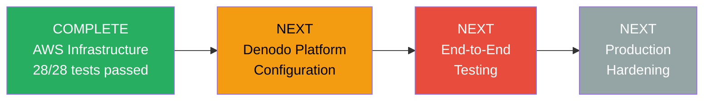
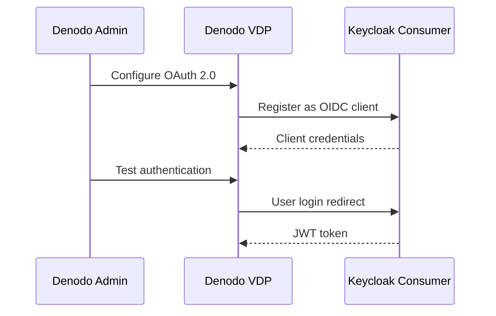
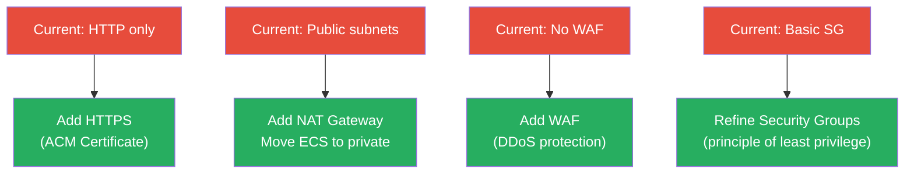
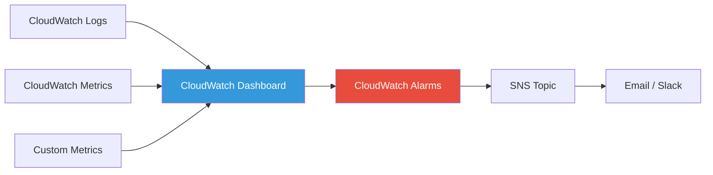
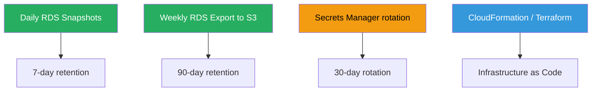

# Denodo POC -- Next Steps for Production Integration

**Date:** 12 February 2026
**Author:** Jaafar Benabderrazak

**Current Status:** All AWS infrastructure deployed and verified (28/28 tests passed). Ready for Denodo platform configuration.

---

## Overview



---

## Phase 1: Denodo Platform Configuration (Priority: HIGH)

### 1.1 Configure OIDC Authentication

Access the Denodo Administration Tool and configure OAuth 2.0 / OpenID Connect authentication.



#### Configuration Details

**Location:** Denodo Admin Tool > Server Configuration > Authentication > OAuth 2.0 / OIDC

| Parameter | Value |
|-----------|-------|
| **Authentication Method** | OAuth 2.0 / OpenID Connect |
| **Authorization Server** | Keycloak |
| **Issuer URL** | `http://keycloak-alb-541762229.eu-west-3.elb.amazonaws.com/auth/realms/denodo-consumer` |
| **Authorization Endpoint** | `http://keycloak-alb-541762229.eu-west-3.elb.amazonaws.com/auth/realms/denodo-consumer/protocol/openid-connect/auth` |
| **Token Endpoint** | `http://keycloak-alb-541762229.eu-west-3.elb.amazonaws.com/auth/realms/denodo-consumer/protocol/openid-connect/token` |
| **Client ID** | `denodo-consumer` |
| **Client Secret** | Get from Secrets Manager (see below) |
| **Scopes** | `openid email profile` |
| **User Info Endpoint** | `http://keycloak-alb-541762229.eu-west-3.elb.amazonaws.com/auth/realms/denodo-consumer/protocol/openid-connect/userinfo` |

**Retrieve Client Secret (CloudShell):**

```bash
aws secretsmanager get-secret-value \
  --secret-id denodo-poc/keycloak/client-secret \
  --region eu-west-3 \
  --query SecretString --output text | jq -r '.clientSecret'
```

**JWT Claims Mapping:**

Map these JWT claims to Denodo user attributes:

| JWT Claim | Denodo Attribute | Example Value |
|-----------|------------------|---------------|
| `email` | Username | `analyst@denodo.com` |
| `preferred_username` | Display Name | `analyst` |
| `profiles` | User Profile | `["data-analyst"]` |
| `datasources` | Data Source Access | `["rds-opendata", "api-geo"]` |
| `department` | Department | `Analytics` |
| `realm_access.roles` | Roles | `["viewer"]` |

**Test Authentication:**

1. Save the configuration
2. Restart Denodo VDP server
3. Access Denodo web UI: `http://<denodo-host>:9090/denodo-data-catalog`
4. Click "Login with OAuth" (or similar)
5. You should be redirected to Keycloak Consumer realm
6. Click "Sign in with provider-idp"
7. Enter `analyst@denodo.com` / `Analyst@2026!`
8. Verify you are logged into Denodo with the correct profile

---

### 1.2 Configure RDS OpenData Data Source

Create a JDBC data source for the OpenData PostgreSQL database.

**Location:** Denodo Admin Tool > File > New > Data source > JDBC

| Parameter | Value |
|-----------|-------|
| **Name** | `DS_OPENDATA_RDS` |
| **Database adapter** | PostgreSQL |
| **Driver class** | `org.postgresql.Driver` |
| **Database URI** | `jdbc:postgresql://denodo-poc-opendata-db.cacjdkje8yxa.eu-west-3.rds.amazonaws.com:5432/opendata` |
| **User** | `denodo` |
| **Password** | Get from Secrets Manager (see below) |
| **Test connection** | Click to verify |

**Retrieve RDS Password (CloudShell):**

```bash
aws secretsmanager get-secret-value \
  --secret-id denodo-poc/opendata/db \
  --region eu-west-3 \
  --query SecretString --output text | jq -r '.password'
```

**Import Base Views:**

1. After creating the data source, right-click > "Create base view"
2. Schema: `opendata`
3. Select tables:
   - `entreprises` (15,000+ French companies)
   - `population_communes` (36,000+ French communes)
   - `entreprises_population` (view joining both)

**Test Query:**

```sql
SELECT 
    nom_raison_sociale,
    ville,
    code_postal,
    libelle_naf
FROM DS_OPENDATA_RDS.opendata.entreprises
WHERE departement = '75'
LIMIT 10;
```

---

### 1.3 Configure geo.api.gouv.fr REST API Data Source

Create a JSON/REST data source for the French Geographic API.

**Location:** Denodo Admin Tool > File > New > Data source > JSON

| Parameter | Value |
|-----------|-------|
| **Name** | `DS_GEO_API_GOUV` |
| **Data route** | HTTP Client |
| **Base URL** | `https://geo.api.gouv.fr` |
| **Authentication** | None (public API) |

**Create Base Views for Common Endpoints:**

1. **Communes by Postal Code:**
   - Path: `/communes`
   - Parameters: `codePostal` (required)
   - Example: `/communes?codePostal=75001&fields=nom,code,population`

2. **Departments:**
   - Path: `/departements/{code}`
   - Example: `/departements/75`

3. **Regions:**
   - Path: `/regions/{code}`
   - Example: `/regions/11`

**Test Query:**

```sql
SELECT *
FROM DS_GEO_API_GOUV.communes
WHERE codePostal = '75001';
```

---

### 1.4 Configure Authorization API Integration

Integrate the Lambda permissions API for dynamic row-level security.

**Option A: REST API Data Source**

Create another JSON data source pointing to the API Gateway.

| Parameter | Value |
|-----------|-------|
| **Name** | `DS_AUTHORIZATION_API` |
| **Base URL** | `https://d53199bvse.execute-api.eu-west-3.amazonaws.com/dev` |
| **Authentication** | Custom HTTP Headers |
| **Header Name** | `X-API-Key` |
| **Header Value** | Get from Secrets Manager (see below) |

**Retrieve API Key (CloudShell):**

```bash
aws secretsmanager get-secret-value \
  --secret-id denodo-poc/api/auth-key \
  --region eu-west-3 \
  --query SecretString --output text | jq -r '.apiKey'
```

**Create Base View:**

- Path: `/api/v1/users/{userId}/permissions`
- Parameter: `userId` = `@email` (from JWT)

**Option B: Custom Wrapper**

Create a Custom Wrapper in Denodo that calls the API at query time and enforces permissions.

---

### 1.5 Create Derived Views (Cross-Source Joins)

Create views that combine data from multiple sources.

**Example 1: Companies with Geographic Data**

```sql
CREATE VIEW companies_with_geo AS
SELECT 
    e.siren,
    e.nom_raison_sociale,
    e.ville,
    e.code_postal,
    e.libelle_naf,
    g.nom AS commune_name,
    g.population,
    g.codeDepartement
FROM DS_OPENDATA_RDS.opendata.entreprises e
LEFT JOIN DS_GEO_API_GOUV.communes g
    ON e.code_postal = g.codesPostaux
WHERE e.statut = 'Actif';
```

**Example 2: User-Specific Permissions View**

```sql
CREATE VIEW my_permissions AS
SELECT *
FROM DS_AUTHORIZATION_API.permissions
WHERE userId = CURRENT_USER();
```

---

## Phase 2: End-to-End Testing (Priority: HIGH)

### 2.1 Test User Scenarios

Execute these scenarios for each test user to verify role-based access control.

#### Scenario: Data Analyst (Limited Access)

```bash
# 1. Login as analyst@denodo.com / Analyst@2026!
# 2. Expected permissions:
#    - profiles: ["data-analyst"]
#    - datasources: ["rds-opendata", "api-geo"]
#    - maxRowsPerQuery: 10,000
#    - canExport: false

# 3. Test queries:
SELECT COUNT(*) FROM DS_OPENDATA_RDS.opendata.entreprises;
# Expected: Returns count up to 10,000 rows

SELECT * FROM companies_with_geo WHERE departement = '75' LIMIT 100;
# Expected: Success

# 4. Test export (should fail)
# Try to export results to CSV
# Expected: Permission denied
```

#### Scenario: Data Scientist (Broader Access)

```bash
# 1. Login as scientist@denodo.com / Scientist@2026!
# 2. Expected permissions:
#    - profiles: ["data-scientist"]
#    - datasources: ["rds-opendata", "api-geo", "api-sirene"]
#    - maxRowsPerQuery: 50,000
#    - canExport: true

# 3. Test queries:
SELECT COUNT(*) FROM DS_OPENDATA_RDS.opendata.entreprises;
# Expected: Returns count up to 50,000 rows

# 4. Test export (should succeed)
# Export results to CSV
# Expected: Success
```

#### Scenario: Administrator (Full Access)

```bash
# 1. Login as admin@denodo.com / Admin@2026!
# 2. Expected permissions:
#    - profiles: ["admin"]
#    - datasources: ["*"]
#    - maxRowsPerQuery: -1 (unlimited)
#    - canManageUsers: true

# 3. Test queries:
SELECT * FROM DS_OPENDATA_RDS.opendata.entreprises;
# Expected: Returns all rows (no limit)

# 4. Test admin operations
# Create new data source, create new user, etc.
# Expected: Success
```

### 2.2 Automated Test Suite

Run the full test suite from CloudShell:

```bash
# Verify infrastructure
./scripts/verify-all.sh

# Run showcase scenarios
# Follow steps in docs/SHOWCASE_SCENARIOS.md (Scenarios 1-10)

# Test Lambda API
API_KEY=$(aws secretsmanager get-secret-value --secret-id denodo-poc/api/auth-key --region eu-west-3 --query SecretString --output text | jq -r '.apiKey')
curl -H "X-API-Key: $API_KEY" \
  "https://d53199bvse.execute-api.eu-west-3.amazonaws.com/dev/api/v1/users/analyst@denodo.com/permissions" | jq '.'
```

---

## Phase 3: Production Hardening (Priority: MEDIUM)

### 3.1 Security Enhancements



#### HTTPS (ACM Certificate)

1. Request ACM certificate for `keycloak.<your-domain>.com`
2. Update ALB listener to HTTPS (port 443)
3. Update Keycloak environment variable: `KC_PROXY=edge`
4. Remove `sslRequired=NONE` workaround from startup script
5. Update all URLs from `http://` to `https://`

#### NAT Gateway

1. Create NAT Gateway in public subnets
2. Update private subnet route tables to use NAT Gateway
3. Update ECS services: `assignPublicIp=DISABLED`
4. Test connectivity (ECS -> RDS, ECS -> Internet for Docker pulls)

#### AWS WAF

1. Create WAF Web ACL
2. Add rules:
   - Rate limiting (e.g., 2000 requests per 5 minutes per IP)
   - Geo-blocking (if needed)
   - Known bad inputs (SQLi, XSS patterns)
3. Associate WAF with ALB

#### Security Groups Refinement

Current setup is permissive for POC. Production should:
- Remove `0.0.0.0/0` ingress where possible
- Use specific security group references
- Enable VPC Flow Logs
- Enable AWS GuardDuty

### 3.2 Monitoring and Alerting



#### CloudWatch Dashboard

Create a unified dashboard with:
- ECS service health (running vs desired tasks)
- ALB target health (healthy vs unhealthy targets)
- ALB response codes (2xx, 4xx, 5xx)
- RDS CPU, memory, connections
- Lambda invocations, errors, duration
- API Gateway request count, latency, errors

#### CloudWatch Alarms

Set up alarms for:
- **ECS:** Any task stops unexpectedly
- **ALB:** Unhealthy target count > 0 for > 5 minutes
- **ALB:** 5xx error rate > 1% for > 5 minutes
- **RDS:** CPU > 80% for > 10 minutes
- **RDS:** Free storage < 20% for > 15 minutes
- **Lambda:** Error rate > 5% for > 5 minutes
- **Lambda:** Duration > 25s (near timeout)

### 3.3 Backup and Disaster Recovery



#### RDS Automated Backups

```bash
# Enable automated backups (already enabled, verify retention)
aws rds modify-db-instance \
  --db-instance-identifier denodo-poc-opendata-db \
  --backup-retention-period 7 \
  --preferred-backup-window "03:00-04:00" \
  --region eu-west-3
```

#### Manual Backup Before Major Changes

```bash
# Create manual snapshot before deploying changes
aws rds create-db-snapshot \
  --db-instance-identifier denodo-poc-opendata-db \
  --db-snapshot-identifier denodo-opendata-manual-$(date +%Y%m%d-%H%M%S) \
  --region eu-west-3
```

#### Secrets Rotation

Enable automatic rotation for:
- Keycloak admin password (30 days)
- RDS master password (90 days)
- API keys (90 days)

### 3.4 Infrastructure as Code

Convert shell scripts to Terraform or AWS CDK:

**Benefits:**
- Version control for infrastructure
- Reproducible deployments
- Easy rollback
- Multi-environment support (dev, staging, prod)

**Suggested Structure:**

```
terraform/
├── modules/
│   ├── vpc/
│   ├── ecs/
│   ├── rds/
│   ├── keycloak/
│   ├── lambda/
│   └── api-gateway/
├── environments/
│   ├── dev/
│   ├── staging/
│   └── prod/
└── main.tf
```

---

## Phase 4: Documentation and Knowledge Transfer (Priority: MEDIUM)

### 4.1 Update Documentation

- [ ] Architecture diagram with production changes (HTTPS, NAT, WAF)
- [ ] Runbook for common operations (restart, scale, backup, restore)
- [ ] Troubleshooting guide with common issues
- [ ] Security incident response plan
- [ ] Disaster recovery procedures

### 4.2 Knowledge Transfer

- [ ] Admin training on Keycloak management (realms, users, clients)
- [ ] Admin training on Denodo data source management
- [ ] Developer training on creating derived views
- [ ] Security team briefing on architecture and security controls
- [ ] Operations team training on monitoring and alerting

---

## Phase 5: Cleanup (After Production Migration)

Once production is stable and tested, clean up POC resources:

```bash
# Option 1: Automated cleanup
./scripts/cleanup-all.sh

# Option 2: Manual cleanup (CloudFormation style)
# Delete ECS services
# Delete RDS instances
# Delete API Gateway
# Delete Lambda
# Delete ALB
# Delete Security Groups
# Delete Secrets (keep for 30 days recovery)

# Verify all resources deleted
aws resourcegroupstaggingapi get-resources \
  --tag-filters "Key=Project,Values=denodo-poc" \
  --region eu-west-3 \
  --query 'ResourceTagMappingList[].ResourceARN' \
  --output table
```

---

## Quick Reference: All Connection Details

### Keycloak

```
Admin Console:  http://keycloak-alb-541762229.eu-west-3.elb.amazonaws.com/auth/admin
Username:       admin
Password:       $(aws secretsmanager get-secret-value --secret-id denodo-poc/keycloak/admin --region eu-west-3 --query SecretString --output text | jq -r '.password')

Provider Realm: http://keycloak-alb-541762229.eu-west-3.elb.amazonaws.com/auth/realms/denodo-idp
Consumer Realm: http://keycloak-alb-541762229.eu-west-3.elb.amazonaws.com/auth/realms/denodo-consumer
```

### Test Users

```
analyst@denodo.com   / Analyst@2026!    (data-analyst, read-only, 10K rows)
scientist@denodo.com / Scientist@2026!  (data-scientist, export, 50K rows)
admin@denodo.com     / Admin@2026!      (admin, full access)
```

### RDS OpenData

```
Host:     denodo-poc-opendata-db.cacjdkje8yxa.eu-west-3.rds.amazonaws.com
Port:     5432
Database: opendata
Schema:   opendata
User:     denodo
Password: $(aws secretsmanager get-secret-value --secret-id denodo-poc/opendata/db --region eu-west-3 --query SecretString --output text | jq -r '.password')
```

### API Gateway

```
Endpoint: https://d53199bvse.execute-api.eu-west-3.amazonaws.com/dev
API Key:  $(aws secretsmanager get-secret-value --secret-id denodo-poc/api/auth-key --region eu-west-3 --query SecretString --output text | jq -r '.apiKey')
```

---

## Timeline Estimate

| Phase | Effort | Timeline |
|-------|--------|----------|
| Phase 1: Denodo Configuration | 1-2 days | Week 1 |
| Phase 2: End-to-End Testing | 2-3 days | Week 1-2 |
| Phase 3: Production Hardening | 3-5 days | Week 2-3 |
| Phase 4: Documentation & Training | 2-3 days | Week 3 |
| Phase 5: Cleanup | 1 day | After go-live |
| **Total** | **9-14 days** | **3-4 weeks** |

---

**Document Version:** 1.0
**Last Updated:** 12 February 2026
**Status:** Infrastructure complete -- ready for Denodo platform configuration
