# Denodo POC -- Step-by-Step Showcase Scenarios

**Date:** 12 February 2026
**Author:** Jaafar Benabderrazak

This document provides step-by-step scenarios to demonstrate every capability of the Denodo Keycloak POC. Each scenario is self-contained and can be executed from **AWS CloudShell** or a **browser**.

---

## Architecture Recap

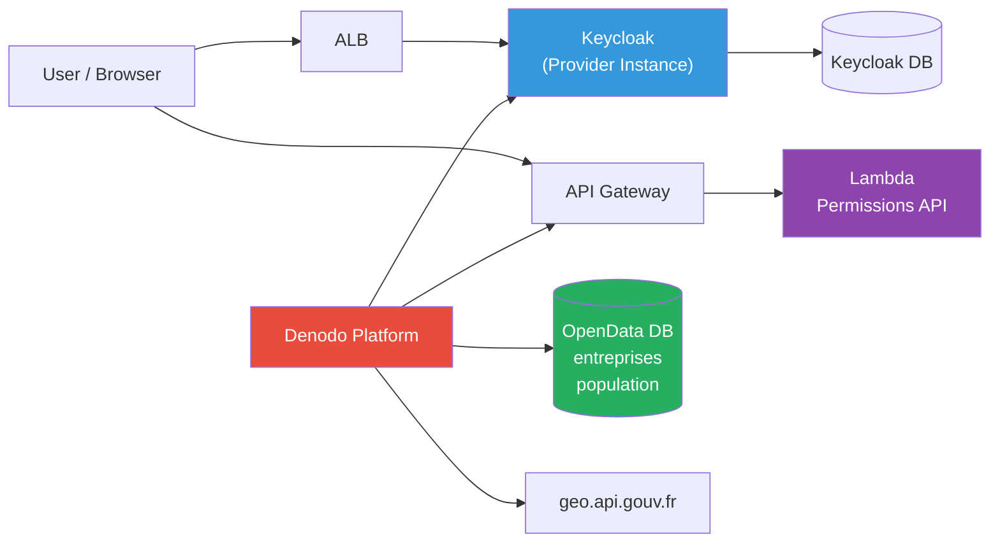

---

## Prerequisites

Before running scenarios, export all credentials:

```bash
# Run this once at the start of your CloudShell session
export ALB_DNS="keycloak-alb-541762229.eu-west-3.elb.amazonaws.com"
export REGION="eu-west-3"

export KC_ADMIN_PWD=$(aws secretsmanager get-secret-value \
  --secret-id denodo-poc/keycloak/admin --region $REGION \
  --query SecretString --output text | jq -r '.password')

export CLIENT_SECRET=$(aws secretsmanager get-secret-value \
  --secret-id denodo-poc/keycloak/client-secret --region $REGION \
  --query SecretString --output text | jq -r '.clientSecret')

export API_KEY=$(aws secretsmanager get-secret-value \
  --secret-id denodo-poc/api/auth-key --region $REGION \
  --query SecretString --output text | jq -r '.apiKey')

export API_ENDPOINT=$(aws apigateway get-rest-apis --region $REGION \
  --query "items[?name=='denodo-auth-api'].id | [-1]" --output text)
export API_URL="https://${API_ENDPOINT}.execute-api.${REGION}.amazonaws.com/dev"

echo "ALB:         $ALB_DNS"
echo "API URL:     $API_URL"
echo "API Key:     ${API_KEY:0:8}..."
echo "Admin pwd:   ${KC_ADMIN_PWD:0:4}..."
echo "Client sec:  ${CLIENT_SECRET:0:8}..."
```

---

## Scenario 1: Keycloak Health and Availability

**Goal:** Verify that Keycloak is running and accessible.

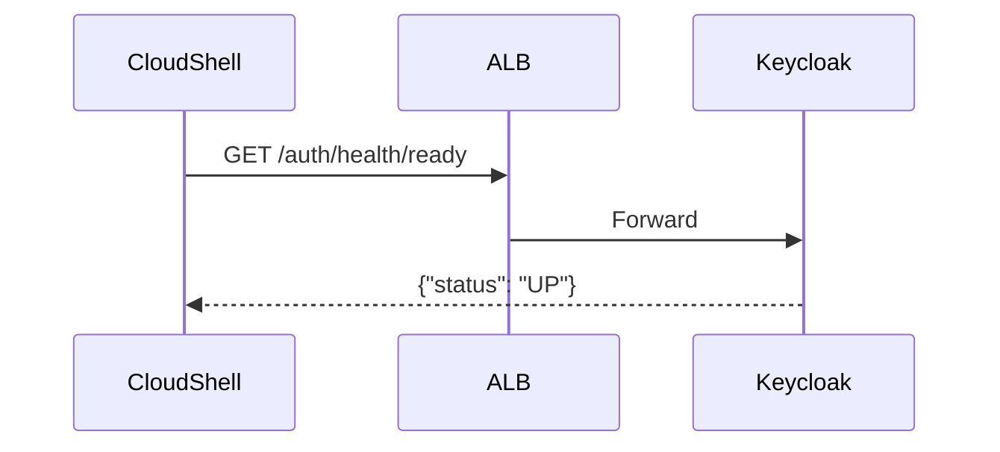

### Steps

```bash
# 1a. Health check (readiness)
curl -s "http://$ALB_DNS/auth/health/ready" | jq '.'
# Expected: {"status": "UP", "checks": [...]}

# 1b. Liveness check
curl -s "http://$ALB_DNS/auth/health/live" | jq '.'
# Expected: {"status": "UP"}

# 1c. Verify admin console is accessible
curl -s -o /dev/null -w "HTTP %{http_code}\n" \
  "http://$ALB_DNS/auth/admin/master/console/"
# Expected: HTTP 200

# 1d. Verify static assets load (ALB catch-all rule)
curl -s -o /dev/null -w "HTTP %{http_code}\n" \
  "http://$ALB_DNS/auth/js/keycloak.js"
# Expected: HTTP 200
```

**Success criteria:** All return HTTP 200 / status UP.

---

## Scenario 2: OIDC Discovery Endpoints

**Goal:** Verify that both Keycloak realms expose valid OIDC configuration.

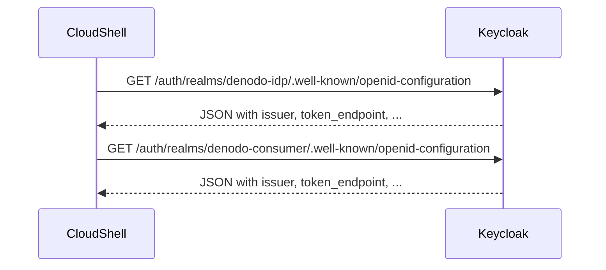

### Steps

```bash
# 2a. Provider realm (Identity Provider)
echo "=== Provider Realm (denodo-idp) ==="
curl -s "http://$ALB_DNS/auth/realms/denodo-idp/.well-known/openid-configuration" | \
  jq '{issuer, token_endpoint, authorization_endpoint, userinfo_endpoint}'

# 2b. Consumer realm (Service Provider)
echo "=== Consumer Realm (denodo-consumer) ==="
curl -s "http://$ALB_DNS/auth/realms/denodo-consumer/.well-known/openid-configuration" | \
  jq '{issuer, token_endpoint, authorization_endpoint, userinfo_endpoint}'
```

**Success criteria:** Both return valid JSON with `issuer`, `token_endpoint`, `authorization_endpoint`.

---

## Scenario 3: Admin Token and Realm Management

**Goal:** Obtain an admin token and explore the Keycloak configuration via API.

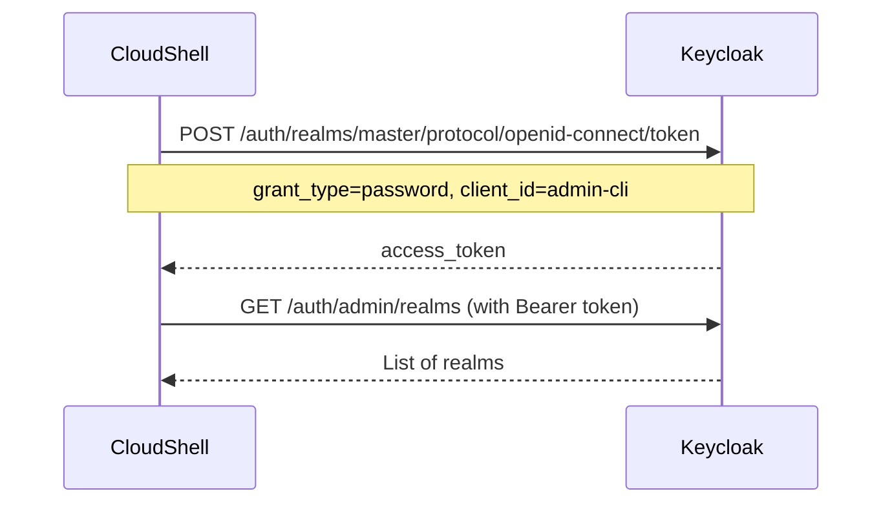

### Steps

```bash
# 3a. Get admin access token
ADMIN_TOKEN=$(curl -s -X POST \
  "http://$ALB_DNS/auth/realms/master/protocol/openid-connect/token" \
  -d "username=admin&password=$KC_ADMIN_PWD&grant_type=password&client_id=admin-cli" | \
  jq -r '.access_token')

echo "Token: ${ADMIN_TOKEN:0:50}..."

# 3b. List all realms
echo "=== Realms ==="
curl -s -H "Authorization: Bearer $ADMIN_TOKEN" \
  "http://$ALB_DNS/auth/admin/realms" | \
  jq '.[].realm'
# Expected: "master", "denodo-idp", "denodo-consumer"

# 3c. List users in denodo-idp realm
echo "=== Users in denodo-idp ==="
curl -s -H "Authorization: Bearer $ADMIN_TOKEN" \
  "http://$ALB_DNS/auth/admin/realms/denodo-idp/users" | \
  jq '.[] | {username, email, enabled, attributes}'

# 3d. List identity providers in denodo-consumer realm
echo "=== Identity Providers in denodo-consumer ==="
curl -s -H "Authorization: Bearer $ADMIN_TOKEN" \
  "http://$ALB_DNS/auth/admin/realms/denodo-consumer/identity-provider/instances" | \
  jq '.[] | {alias, displayName, enabled, providerId}'

# 3e. List clients in denodo-idp realm
echo "=== Clients in denodo-idp ==="
curl -s -H "Authorization: Bearer $ADMIN_TOKEN" \
  "http://$ALB_DNS/auth/admin/realms/denodo-idp/clients" | \
  jq '.[] | select(.clientId == "denodo-consumer") | {clientId, enabled, protocol}'
```

**Success criteria:** 3 realms visible, 3 users in denodo-idp, provider-idp identity provider in denodo-consumer.

---

## Scenario 4: User Authentication (Password Grant)

**Goal:** Authenticate each test user against the Provider realm and inspect the JWT claims.

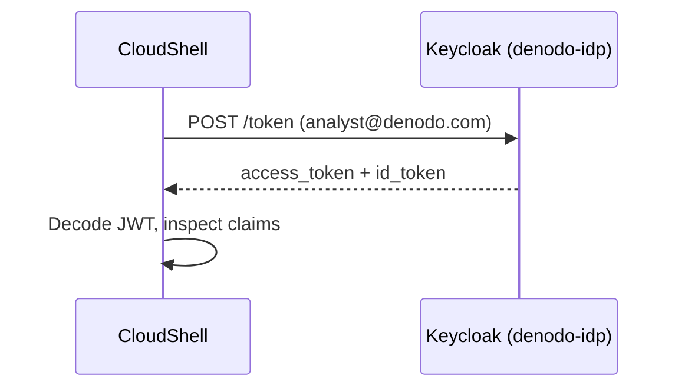

### Steps

```bash
# 4a. Authenticate as analyst
echo "=== Analyst ==="
ANALYST_TOKEN=$(curl -s -X POST \
  "http://$ALB_DNS/auth/realms/denodo-idp/protocol/openid-connect/token" \
  -d "username=analyst@denodo.com&password=Analyst@2026!&grant_type=password&client_id=denodo-consumer&client_secret=$CLIENT_SECRET&scope=openid email profile" | \
  jq -r '.access_token')

# Decode JWT payload (middle segment)
echo "$ANALYST_TOKEN" | cut -d. -f2 | tr '_-' '/+' | base64 -d 2>/dev/null | jq '{email, preferred_username, profiles, datasources, department, realm_access}'

# 4b. Authenticate as scientist
echo "=== Scientist ==="
SCIENTIST_TOKEN=$(curl -s -X POST \
  "http://$ALB_DNS/auth/realms/denodo-idp/protocol/openid-connect/token" \
  -d "username=scientist@denodo.com&password=Scientist@2026!&grant_type=password&client_id=denodo-consumer&client_secret=$CLIENT_SECRET&scope=openid email profile" | \
  jq -r '.access_token')

echo "$SCIENTIST_TOKEN" | cut -d. -f2 | tr '_-' '/+' | base64 -d 2>/dev/null | jq '{email, preferred_username, profiles, datasources, department, realm_access}'

# 4c. Authenticate as admin
echo "=== Admin ==="
ADMIN_USER_TOKEN=$(curl -s -X POST \
  "http://$ALB_DNS/auth/realms/denodo-idp/protocol/openid-connect/token" \
  -d "username=admin@denodo.com&password=Admin@2026!&grant_type=password&client_id=denodo-consumer&client_secret=$CLIENT_SECRET&scope=openid email profile" | \
  jq -r '.access_token')

echo "$ADMIN_USER_TOKEN" | cut -d. -f2 | tr '_-' '/+' | base64 -d 2>/dev/null | jq '{email, preferred_username, profiles, datasources, department, realm_access}'
```

**Success criteria:** Each user gets a valid JWT with correct `email`, `profiles`, `datasources`, and `realm_access` claims.

---

## Scenario 5: OIDC Federation (Consumer to Provider Brokering)

**Goal:** Verify that the Consumer realm can federate authentication to the Provider realm.

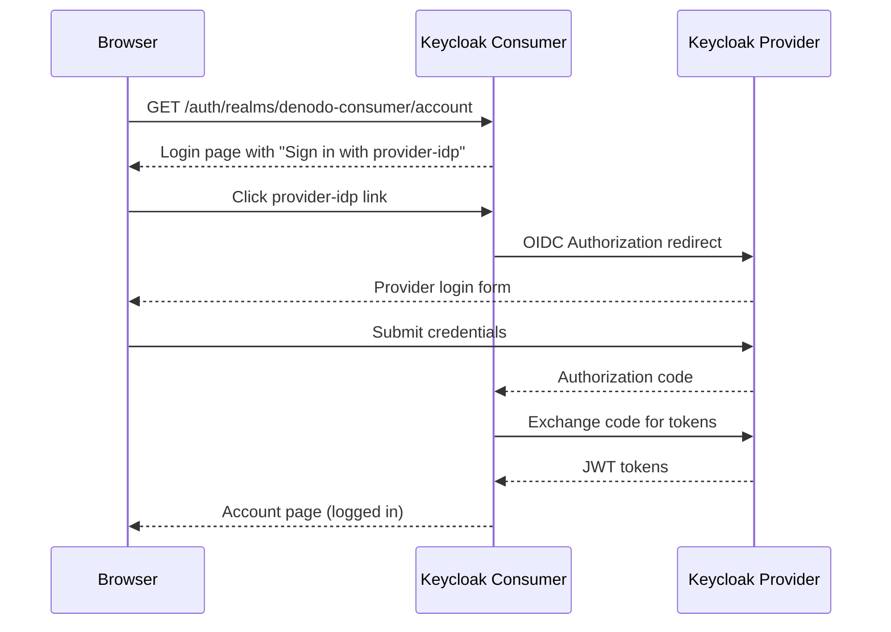

### Steps (Browser)

1. Open in browser:
   ```
   http://keycloak-alb-541762229.eu-west-3.elb.amazonaws.com/auth/realms/denodo-consumer/account
   ```

2. You should see a login page with a button **"Sign in with provider-idp"** (or "Denodo Identity Provider")

3. Click the button -- you will be redirected to the **Provider** realm login form

4. Enter credentials:
   - **Username:** `analyst@denodo.com`
   - **Password:** `Analyst@2026!`

5. After successful login, you will be redirected back to the **Consumer** realm account page

6. The account page shows the federated user information

### Steps (CloudShell -- Verify configuration)

```bash
# Verify the federation is configured
ADMIN_TOKEN=$(curl -s -X POST \
  "http://$ALB_DNS/auth/realms/master/protocol/openid-connect/token" \
  -d "username=admin&password=$KC_ADMIN_PWD&grant_type=password&client_id=admin-cli" | \
  jq -r '.access_token')

# Check IdP configuration
curl -s -H "Authorization: Bearer $ADMIN_TOKEN" \
  "http://$ALB_DNS/auth/admin/realms/denodo-consumer/identity-provider/instances/provider-idp" | \
  jq '{alias, enabled, providerId, config: {authorizationUrl: .config.authorizationUrl, tokenUrl: .config.tokenUrl, clientId: .config.clientId}}'

# Check the consumer account page returns a redirect (302)
curl -s -o /dev/null -w "HTTP %{http_code}\n" \
  "http://$ALB_DNS/auth/realms/denodo-consumer/account"
# Expected: HTTP 302 (redirect to login)
```

**Success criteria:** Browser shows account page after federation login. CloudShell shows IdP configured with correct URLs.

---

## Scenario 6: Authorization API (Lambda Permissions)

**Goal:** Query the permissions API for each user and verify role-based access control.

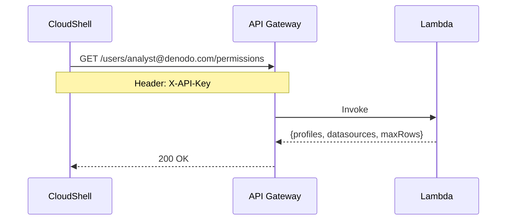

### Steps

```bash
# 6a. Analyst permissions (limited access)
echo "=== Analyst Permissions ==="
curl -s -H "X-API-Key: $API_KEY" \
  "$API_URL/api/v1/users/analyst@denodo.com/permissions" | jq '.'
# Expected: profiles=["data-analyst"], maxRowsPerQuery=10000, canExport=false

# 6b. Scientist permissions (broader access)
echo "=== Scientist Permissions ==="
curl -s -H "X-API-Key: $API_KEY" \
  "$API_URL/api/v1/users/scientist@denodo.com/permissions" | jq '.'
# Expected: profiles=["data-scientist"], maxRowsPerQuery=50000, canExport=true, 3 datasources

# 6c. Admin permissions (full access)
echo "=== Admin Permissions ==="
curl -s -H "X-API-Key: $API_KEY" \
  "$API_URL/api/v1/users/admin@denodo.com/permissions" | jq '.'
# Expected: profiles=["admin"], maxRowsPerQuery=-1, canManageUsers=true, datasources=["*"]

# 6d. Unknown user (guest fallback)
echo "=== Unknown User ==="
curl -s -H "X-API-Key: $API_KEY" \
  "$API_URL/api/v1/users/unknown@test.com/permissions" | jq '.'
# Expected: profiles=["guest"], maxRowsPerQuery=1000

# 6e. Missing API key (should be rejected)
echo "=== No API Key ==="
curl -s -o /dev/null -w "HTTP %{http_code}\n" \
  "$API_URL/api/v1/users/analyst@denodo.com/permissions"
# Expected: HTTP 403

# 6f. Invalid API key (should be rejected)
echo "=== Invalid API Key ==="
curl -s -o /dev/null -w "HTTP %{http_code}\n" \
  -H "X-API-Key: INVALID_KEY_12345" \
  "$API_URL/api/v1/users/analyst@denodo.com/permissions"
# Expected: HTTP 403
```

### Comparison Table

| User | Profile | Datasources | Max Rows | Export | Create Views |
|------|---------|-------------|----------|--------|-------------|
| analyst@denodo.com | data-analyst | rds-opendata, api-geo | 10,000 | No | No |
| scientist@denodo.com | data-scientist | rds-opendata, api-geo, api-sirene | 50,000 | Yes | Yes |
| admin@denodo.com | admin | all (*) | unlimited | Yes | Yes |
| unknown@test.com | guest | none | 1,000 | No | No |

**Success criteria:** Each user returns correct profile, datasources, and permissions. Unauthorized requests return 403.

---

## Scenario 7: OpenData RDS Access (via SSM)

**Goal:** Query the OpenData PostgreSQL database through the Denodo EC2 instance.

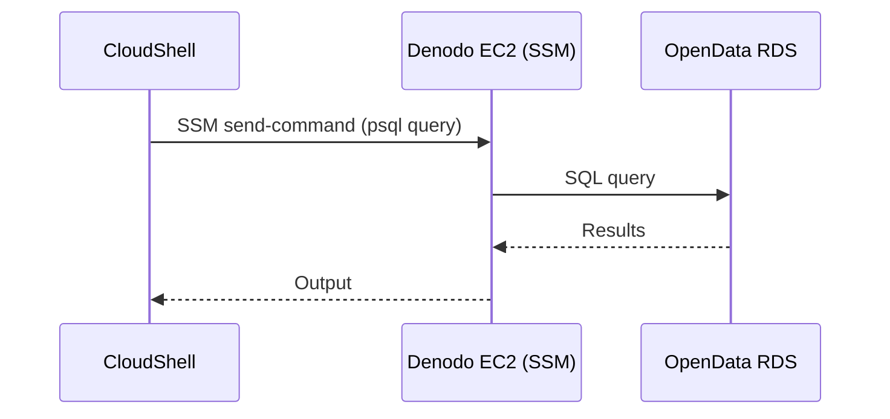

### Steps

```bash
# Get DB credentials
DB_HOST=$(aws rds describe-db-instances \
  --db-instance-identifier denodo-poc-opendata-db --region $REGION \
  --query 'DBInstances[0].Endpoint.Address' --output text)
DB_PASS=$(aws secretsmanager get-secret-value \
  --secret-id denodo-poc/opendata/db --region $REGION \
  --query SecretString --output text | jq -r '.password')
EC2_ID="i-0aef555dcb0ff873f"

# 7a. List tables
echo "=== Tables in opendata schema ==="
CMD_ID=$(aws ssm send-command --instance-ids $EC2_ID \
  --document-name "AWS-RunShellScript" \
  --parameters "commands=[\"PGPASSWORD='$DB_PASS' psql -h $DB_HOST -U denodo -d opendata -t -A -c \\\"SELECT tablename FROM pg_tables WHERE schemaname='opendata';\\\"\"]" \
  --region $REGION --query 'Command.CommandId' --output text)
sleep 5
aws ssm get-command-invocation --command-id $CMD_ID --instance-id $EC2_ID \
  --region $REGION --query 'StandardOutputContent' --output text

# 7b. Count rows in entreprises
echo "=== Entreprises count ==="
CMD_ID=$(aws ssm send-command --instance-ids $EC2_ID \
  --document-name "AWS-RunShellScript" \
  --parameters "commands=[\"PGPASSWORD='$DB_PASS' psql -h $DB_HOST -U denodo -d opendata -t -A -c \\\"SELECT COUNT(*) FROM opendata.entreprises;\\\"\"]" \
  --region $REGION --query 'Command.CommandId' --output text)
sleep 5
aws ssm get-command-invocation --command-id $CMD_ID --instance-id $EC2_ID \
  --region $REGION --query 'StandardOutputContent' --output text

# 7c. Count rows in population_communes
echo "=== Population communes count ==="
CMD_ID=$(aws ssm send-command --instance-ids $EC2_ID \
  --document-name "AWS-RunShellScript" \
  --parameters "commands=[\"PGPASSWORD='$DB_PASS' psql -h $DB_HOST -U denodo -d opendata -t -A -c \\\"SELECT COUNT(*) FROM opendata.population_communes;\\\"\"]" \
  --region $REGION --query 'Command.CommandId' --output text)
sleep 5
aws ssm get-command-invocation --command-id $CMD_ID --instance-id $EC2_ID \
  --region $REGION --query 'StandardOutputContent' --output text

# 7d. Sample query: Top 5 companies in Paris with population
echo "=== Top 5 companies in Paris ==="
CMD_ID=$(aws ssm send-command --instance-ids $EC2_ID \
  --document-name "AWS-RunShellScript" \
  --parameters "commands=[\"PGPASSWORD='$DB_PASS' psql -h $DB_HOST -U denodo -d opendata -t -A -c \\\"SELECT e.nom_raison_sociale, e.ville, p.population FROM opendata.entreprises e LEFT JOIN opendata.population_communes p ON e.code_postal = p.code_postal WHERE e.departement = '75' AND p.population IS NOT NULL ORDER BY p.population DESC LIMIT 5;\\\"\"]" \
  --region $REGION --query 'Command.CommandId' --output text)
sleep 5
aws ssm get-command-invocation --command-id $CMD_ID --instance-id $EC2_ID \
  --region $REGION --query 'StandardOutputContent' --output text
```

**Success criteria:** Tables exist, row counts are non-zero, cross-table queries return data.

---

## Scenario 8: Public API Integration (geo.api.gouv.fr)

**Goal:** Demonstrate the public REST API that Denodo will consume alongside RDS data.

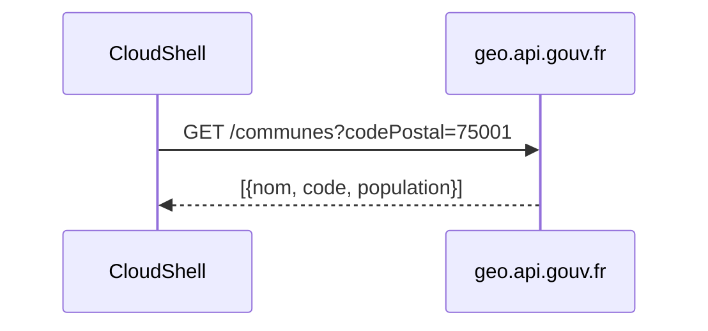

### Steps

```bash
# 8a. Get communes by postal code
echo "=== Communes in 75001 (Paris 1er) ==="
curl -s "https://geo.api.gouv.fr/communes?codePostal=75001&fields=nom,code,codeDepartement,population" | jq '.'

# 8b. Get department info
echo "=== Department 75 (Paris) ==="
curl -s "https://geo.api.gouv.fr/departements/75" | jq '.'

# 8c. Get region info
echo "=== Region 11 (Ile-de-France) ==="
curl -s "https://geo.api.gouv.fr/regions/11" | jq '.'

# 8d. Search communes by name
echo "=== Communes named 'Lyon' ==="
curl -s "https://geo.api.gouv.fr/communes?nom=Lyon&fields=nom,code,codeDepartement,population&limit=5" | jq '.'

# 8e. Get all departments
echo "=== All departments (count) ==="
curl -s "https://geo.api.gouv.fr/departements" | jq '. | length'
# Expected: 101 (metropolitan + overseas)
```

**Success criteria:** API returns valid JSON data for all geographic queries.

---

## Scenario 9: End-to-End Data Flow Simulation

**Goal:** Simulate the full Denodo data flow -- authenticate, get permissions, query data.

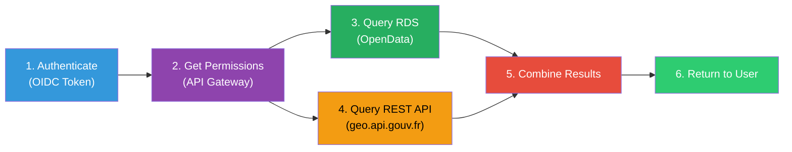

### Steps

```bash
echo "======================================"
echo "  END-TO-END DATA FLOW SIMULATION"
echo "======================================"
echo ""

# Step 1: Authenticate as analyst
echo "STEP 1: Authenticate analyst@denodo.com"
TOKEN_RESPONSE=$(curl -s -X POST \
  "http://$ALB_DNS/auth/realms/denodo-idp/protocol/openid-connect/token" \
  -d "username=analyst@denodo.com&password=Analyst@2026!&grant_type=password&client_id=denodo-consumer&client_secret=$CLIENT_SECRET&scope=openid email profile")

ACCESS_TOKEN=$(echo "$TOKEN_RESPONSE" | jq -r '.access_token')
if [ "$ACCESS_TOKEN" != "null" ] && [ ! -z "$ACCESS_TOKEN" ]; then
  echo "  [OK] Authenticated. Token: ${ACCESS_TOKEN:0:30}..."
  EMAIL=$(echo "$ACCESS_TOKEN" | cut -d. -f2 | tr '_-' '/+' | base64 -d 2>/dev/null | jq -r '.email')
  echo "  [OK] Email from JWT: $EMAIL"
else
  echo "  [FAIL] Authentication failed"
  echo "$TOKEN_RESPONSE" | jq '.'
  exit 1
fi
echo ""

# Step 2: Get permissions
echo "STEP 2: Get permissions for $EMAIL"
PERMISSIONS=$(curl -s -H "X-API-Key: $API_KEY" \
  "$API_URL/api/v1/users/$EMAIL/permissions")
PROFILE=$(echo "$PERMISSIONS" | jq -r '.profiles[0]')
MAX_ROWS=$(echo "$PERMISSIONS" | jq -r '.maxRowsPerQuery')
CAN_EXPORT=$(echo "$PERMISSIONS" | jq -r '.canExport')
DS_COUNT=$(echo "$PERMISSIONS" | jq '.datasources | length')
echo "  [OK] Profile: $PROFILE"
echo "  [OK] Max rows: $MAX_ROWS"
echo "  [OK] Can export: $CAN_EXPORT"
echo "  [OK] Datasources: $DS_COUNT"
echo ""

# Step 3: Query RDS (simulated via SSM)
echo "STEP 3: Query OpenData RDS (via SSM)"
CMD_ID=$(aws ssm send-command --instance-ids $EC2_ID \
  --document-name "AWS-RunShellScript" \
  --parameters "commands=[\"PGPASSWORD='$DB_PASS' psql -h $DB_HOST -U denodo -d opendata -t -A -c \\\"SELECT COUNT(*) as total FROM opendata.entreprises WHERE departement = '75';\\\"\"]" \
  --region $REGION --query 'Command.CommandId' --output text)
sleep 5
PARIS_COUNT=$(aws ssm get-command-invocation --command-id $CMD_ID --instance-id $EC2_ID \
  --region $REGION --query 'StandardOutputContent' --output text | tr -d '[:space:]')
echo "  [OK] Companies in Paris (dept 75): $PARIS_COUNT"
echo ""

# Step 4: Query Public API
echo "STEP 4: Query geo.api.gouv.fr"
PARIS_POP=$(curl -s "https://geo.api.gouv.fr/departements/75/communes?fields=nom,population" | \
  jq '[.[].population] | add')
echo "  [OK] Total population in Paris communes: $PARIS_POP"
echo ""

# Step 5: Combine (simulated)
echo "STEP 5: Combined data (simulated Denodo join)"
echo "  Companies in Paris: $PARIS_COUNT"
echo "  Population in Paris: $PARIS_POP"
if [ ! -z "$PARIS_COUNT" ] && [ "$PARIS_COUNT" != "0" ] && [ ! -z "$PARIS_POP" ]; then
  echo "  [OK] Both data sources returned data -- Denodo can join them"
else
  echo "  [WARN] One or more data sources returned empty"
fi
echo ""

# Step 6: Summary
echo "STEP 6: Access decision"
echo "  User: $EMAIL"
echo "  Profile: $PROFILE"
echo "  Allowed datasources: $(echo "$PERMISSIONS" | jq -r '[.datasources[].id] | join(", ")')"
echo "  Max rows per query: $MAX_ROWS"
echo "  Export allowed: $CAN_EXPORT"
echo ""
echo "  [OK] End-to-end flow completed successfully"
```

**Success criteria:** All 6 steps complete with valid data. The simulation proves that authentication, authorization, and data access all work together.

---

## Scenario 10: Security Validation

**Goal:** Verify that security controls are properly enforced.

### Steps

```bash
echo "=== Security Validation ==="

# 10a. API Gateway rejects requests without API key
echo "Test: No API key"
curl -s -o /dev/null -w "  HTTP %{http_code} (expected 403)\n" \
  "$API_URL/api/v1/users/analyst@denodo.com/permissions"

# 10b. API Gateway rejects invalid API keys
echo "Test: Invalid API key"
curl -s -o /dev/null -w "  HTTP %{http_code} (expected 403)\n" \
  -H "X-API-Key: FAKE_KEY_123" \
  "$API_URL/api/v1/users/analyst@denodo.com/permissions"

# 10c. Keycloak rejects invalid credentials
echo "Test: Invalid password"
FAIL_RESP=$(curl -s -X POST \
  "http://$ALB_DNS/auth/realms/denodo-idp/protocol/openid-connect/token" \
  -d "username=analyst@denodo.com&password=WRONG&grant_type=password&client_id=denodo-consumer&client_secret=$CLIENT_SECRET")
echo "  $(echo "$FAIL_RESP" | jq -r '.error // "unexpected"') (expected invalid_grant)"

# 10d. Keycloak rejects invalid client secret
echo "Test: Invalid client secret"
FAIL_RESP=$(curl -s -X POST \
  "http://$ALB_DNS/auth/realms/denodo-idp/protocol/openid-connect/token" \
  -d "username=analyst@denodo.com&password=Analyst@2026!&grant_type=password&client_id=denodo-consumer&client_secret=WRONG_SECRET")
echo "  $(echo "$FAIL_RESP" | jq -r '.error // "unexpected"') (expected unauthorized_client)"

# 10e. Non-existent realm returns 404
echo "Test: Non-existent realm"
curl -s -o /dev/null -w "  HTTP %{http_code} (expected 404)\n" \
  "http://$ALB_DNS/auth/realms/does-not-exist/.well-known/openid-configuration"
```

**Success criteria:** All security controls return expected rejection codes.

---

## Quick Reference: Scenario Checklist

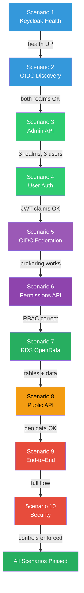

| # | Scenario | Type | Duration |
|---|----------|------|----------|
| 1 | Keycloak Health | CloudShell | 10s |
| 2 | OIDC Discovery | CloudShell | 10s |
| 3 | Admin Token + Realm Management | CloudShell | 15s |
| 4 | User Authentication | CloudShell | 15s |
| 5 | OIDC Federation | Browser + CloudShell | 30s |
| 6 | Authorization API | CloudShell | 15s |
| 7 | OpenData RDS | CloudShell (SSM) | 30s |
| 8 | Public API | CloudShell | 10s |
| 9 | End-to-End Flow | CloudShell (SSM) | 45s |
| 10 | Security Validation | CloudShell | 15s |

**Total demo time: ~3 minutes**

---

**Document Version:** 1.0
**Last Updated:** 12 February 2026
**Author:** Jaafar Benabderrazak
