# Denodo Keycloak POC - Test Results Analysis

**Date:** 26 February 2026
**Author:** Jaafar Benabderrazak
**Status:** 39/39 tests passing (3 suites)
**Region:** eu-west-3 (Paris)

---

## Table of Contents

1. [Architecture Overview](#1-architecture-overview)
2. [Test Suite Structure](#2-test-suite-structure)
3. [Suite 1: Authentication Tests (14/14)](#3-suite-1-authentication-tests)
4. [Suite 2: Authorization API Tests (17/17)](#4-suite-2-authorization-api-tests)
5. [Suite 3: Data Sources Tests (8/8)](#5-suite-3-data-sources-tests)
6. [Permission Model Deep Dive](#6-permission-model-deep-dive)
7. [JWT Token Structure Analysis](#7-jwt-token-structure-analysis)
8. [Security Validation](#8-security-validation)
9. [Remarks and Observations](#9-remarks-and-observations)

---

## 1. Architecture Overview

The test suite validates every layer of the deployed infrastructure, from network health through identity federation to data access control.

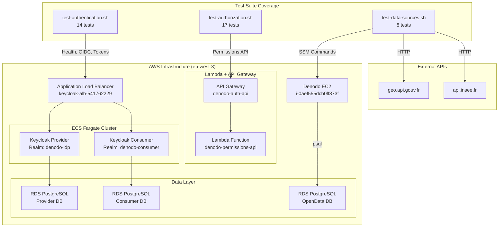

### Deployed Components

| Component | Resource | Endpoint |
|-----------|----------|----------|
| Keycloak (ALB) | keycloak-alb-541762229 | `http://keycloak-alb-541762229.eu-west-3.elb.amazonaws.com` |
| API Gateway | denodo-auth-api | `https://d53199bvse.execute-api.eu-west-3.amazonaws.com/dev` |
| Lambda | denodo-permissions-api | Python 3.11 / 256 MB / 30s timeout |
| OpenData RDS | denodo-poc-opendata-db | PostgreSQL, 988 entreprises + 34,969 communes |
| Denodo EC2 | i-0aef555dcb0ff873f | SSM-managed (no SSH, no VPN) |

---

## 2. Test Suite Structure

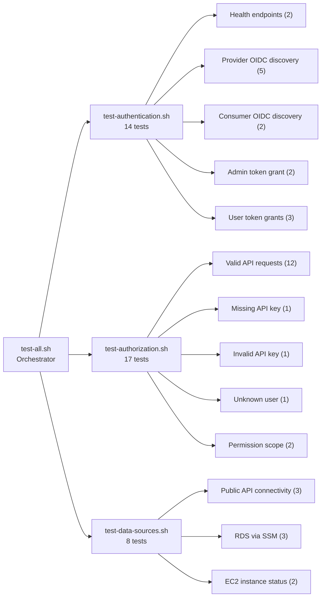

### Running the Tests

```bash
# Standard mode (pass/fail only)
./tests/test-all.sh

# Verbose mode (full JSON payloads, token details, data samples)
./tests/test-all.sh -v
```

---

## 3. Suite 1: Authentication Tests

**Purpose:** Validates that Keycloak is operational, both realms expose OIDC endpoints, and all user accounts can authenticate via the Resource Owner Password Grant.

### 3.1 Health Endpoints

```
✓ PASS Keycloak health/ready returns 200
✓ PASS Keycloak health/live returns 200
```

**What this validates:** The ECS Fargate task is running, the ALB target group health check is passing, and Keycloak has completed its startup sequence (database migrations, realm initialization).

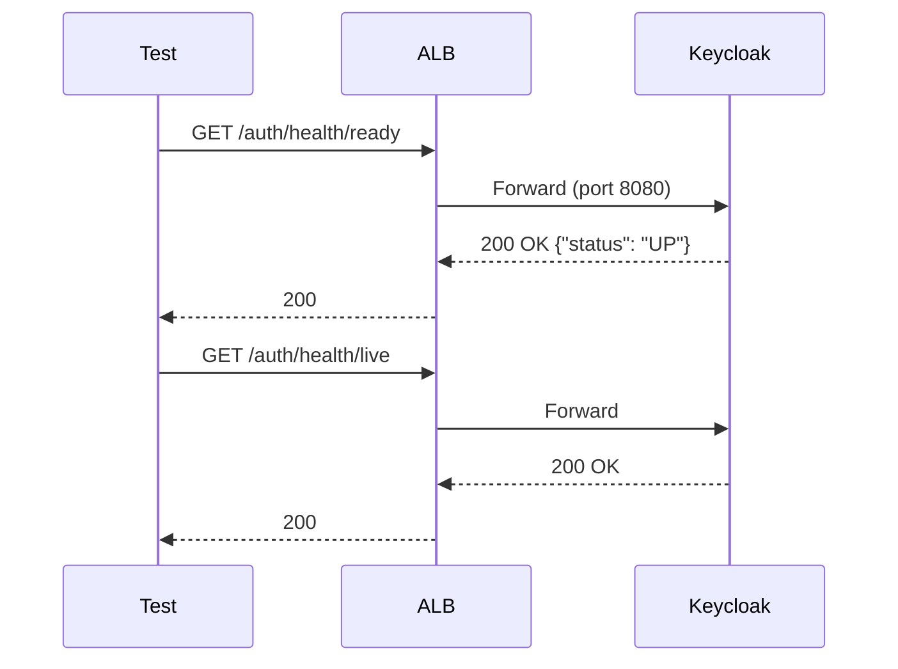

> **Remark:** `/health/ready` indicates Keycloak is ready to serve requests (database connected, realms loaded). `/health/live` is a simpler liveness probe (JVM running). Both are required for ECS service health.

### 3.2 OIDC Discovery (Provider Realm: denodo-idp)

```
✓ PASS Provider OIDC issuer is set
✓ PASS Provider authorization_endpoint is set
✓ PASS Provider token_endpoint is set
✓ PASS Provider userinfo_endpoint is set
✓ PASS Provider jwks_uri is set
```

**What this validates:** The `denodo-idp` realm is fully configured and exposes standard OIDC metadata at `.well-known/openid-configuration`.

**Key OIDC Discovery Fields (actual output):**

| Field | Value | Purpose |
|-------|-------|---------|
| `issuer` | `http://.../auth/realms/denodo-idp` | Token issuer identifier; must match `iss` claim in JWTs |
| `authorization_endpoint` | `.../protocol/openid-connect/auth` | Where browsers redirect for interactive login |
| `token_endpoint` | `.../protocol/openid-connect/token` | Programmatic token exchange (used by tests) |
| `userinfo_endpoint` | `.../protocol/openid-connect/userinfo` | Retrieve claims about the authenticated user |
| `jwks_uri` | `.../protocol/openid-connect/certs` | Public keys to verify JWT signatures |

**Supported Grant Types:**

| Grant | Used By | Notes |
|-------|---------|-------|
| `authorization_code` | Browser-based login | Primary for Denodo integration |
| `password` | Test scripts | Resource Owner Password Credentials (used here) |
| `client_credentials` | Service-to-service | Machine-to-machine access |
| `refresh_token` | Token renewal | Extends sessions without re-authentication |
| `urn:openid:params:grant-type:ciba` | Backend channel | Client-Initiated Backchannel Authentication |
| `urn:ietf:params:oauth:grant-type:device_code` | Device flow | IoT / limited input devices |

**Supported Scopes:**

```
openid, address, microprofile-jwt, offline_access, email, phone, roles, web-origins, acr, profile
```

> **Remark:** The `roles` scope is important for Denodo integration — it includes realm_access roles in the JWT. The `offline_access` scope enables long-lived refresh tokens for batch jobs.

**Security Features Confirmed:**

| Feature | Status | Significance |
|---------|--------|-------------|
| PKCE (S256) | `code_challenge_methods_supported: ["plain", "S256"]` | Protects authorization code flow against interception |
| mTLS | `tls_client_certificate_bound_access_tokens: true` | Certificate-bound tokens supported |
| PAR | `pushed_authorization_request_endpoint` present | Pushed Authorization Requests supported |
| Backchannel Logout | `backchannel_logout_supported: true` | Single logout across federated systems |

### 3.3 Consumer Realm (denodo-consumer)

```
✓ PASS Consumer OIDC issuer is set
✓ PASS Consumer token_endpoint is set
```

**What this validates:** The federated consumer realm is operational and can accept token requests. In the federation model, the Consumer realm trusts the Provider realm via OIDC Identity Brokering.

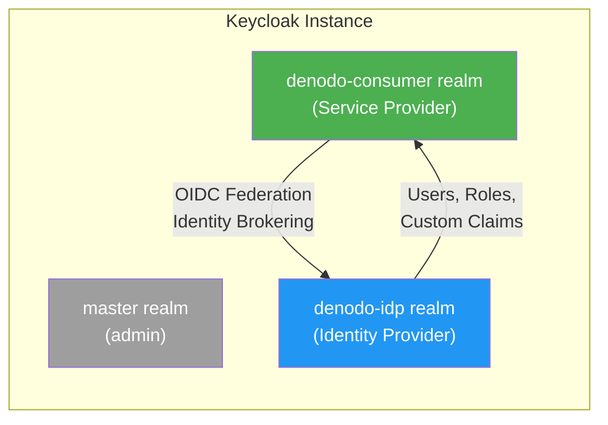

> **Remark:** The federation architecture separates identity management (Provider) from service access (Consumer). Users authenticate against `denodo-idp`; applications (like Denodo) connect to `denodo-consumer` which brokers to the Provider transparently.

### 3.4 Admin Token Grant

```
✓ PASS Admin token grant returns access_token
✓ PASS Admin token type is Bearer
```

**Admin Token Response (metadata):**

```json
{
  "token_type": "Bearer",
  "expires_in": 60,
  "refresh_expires_in": 1800,
  "scope": "profile email",
  "not_before_policy": 0,
  "session_state": "be16a738-1da8-4d1c-adaf-7c6ed4db71a7"
}
```

**Admin JWT Payload:**

```json
{
  "exp": 1772142655,
  "iat": 1772142595,
  "iss": "http://keycloak-alb-541762229.eu-west-3.elb.amazonaws.com/auth/realms/master",
  "sub": "51153421-2c8f-4ac6-a158-a107a6ae4f2f",
  "typ": "Bearer",
  "azp": "admin-cli",
  "session_state": "f0869a34-ce3f-4b31-9914-e15b271fc19d",
  "acr": "1",
  "scope": "profile email",
  "email_verified": false,
  "preferred_username": "admin"
}
```

> **Remark:** The admin token is issued by the `master` realm (not `denodo-idp`), has a short 60-second TTL for security, and uses the built-in `admin-cli` client. This token is used for Keycloak Admin REST API calls only.

### 3.5 User Token Grants

All three test users authenticate successfully against the `denodo-idp` realm.

```
✓ PASS User analyst@denodo.com can authenticate
✓ PASS User scientist@denodo.com can authenticate
✓ PASS User admin@denodo.com can authenticate
```

**Token Comparison:**

| Field | Analyst | Scientist | Admin |
|-------|---------|-----------|-------|
| **Name** | Data Analyst | Data Scientist | System Administrator |
| **Department** | Analytics | Research | IT |
| **Profiles** | `["data-analyst"]` | `["data-scientist"]` | `["admin"]` |
| **Datasources** | `["rds-opendata,api-geo"]` | `["rds-opendata,api-geo,api-sirene"]` | `["*"]` |
| **Token TTL** | 300s (5 min) | 300s (5 min) | 300s (5 min) |
| **Refresh TTL** | 1800s (30 min) | 1800s (30 min) | 1800s (30 min) |
| **Client** | denodo-consumer | denodo-consumer | denodo-consumer |

> **Remark:** The `datasources` and `profiles` are **custom claims** configured in Keycloak as User Attributes and mapped to the JWT via Protocol Mappers. These claims are NOT standard OIDC — they are specific to this POC's authorization model and are consumed by the Lambda permissions API.

---

## 4. Suite 2: Authorization API Tests

**Purpose:** Validates the Lambda-backed permissions API, which translates user identity into granular data access rules for Denodo.

### Architecture Flow

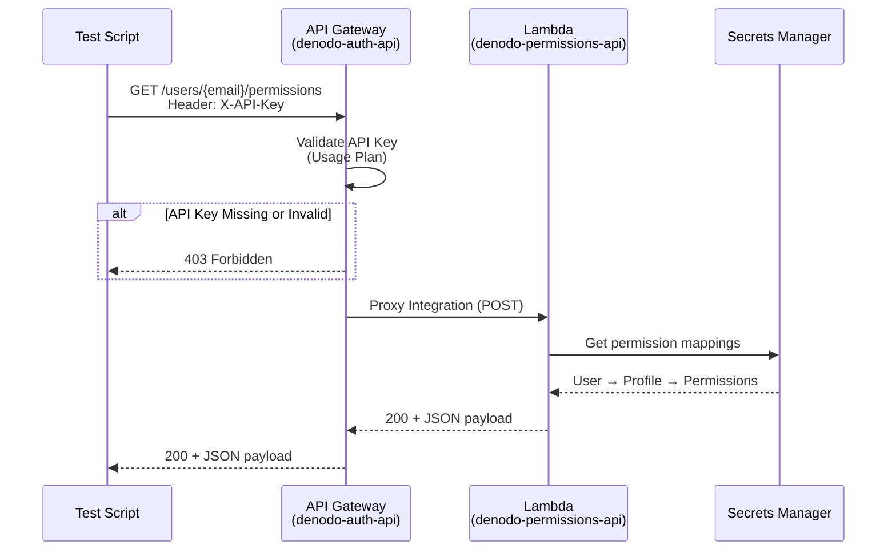

### 4.1 Valid API Requests (12 tests)

For each of the 3 users, the test validates:
- HTTP 200 status
- Response contains `userId`
- Response contains `profiles`
- Response contains `datasources`

#### Analyst Permissions (analyst@denodo.com)

```json
{
  "userId": "analyst@denodo.com",
  "name": "Data Analyst",
  "profiles": ["data-analyst"],
  "roles": ["viewer"],
  "datasources": [
    {
      "id": "rds-opendata",
      "name": "French OpenData (SIRENE + Population)",
      "type": "postgresql",
      "host": "denodo-poc-opendata-db",
      "database": "opendata",
      "schema": "opendata",
      "permissions": ["read", "query"],
      "tables": [
        "entreprises",
        "population_communes",
        "entreprises_population"
      ]
    },
    {
      "id": "api-geo",
      "name": "French Geographic API",
      "type": "rest-api",
      "baseUrl": "https://geo.api.gouv.fr",
      "permissions": ["read"],
      "endpoints": ["/communes", "/departements", "/regions"]
    }
  ],
  "maxRowsPerQuery": 10000,
  "canExport": false,
  "canCreateViews": false
}
```

#### Scientist Permissions (scientist@denodo.com)

```json
{
  "userId": "scientist@denodo.com",
  "name": "Data Scientist",
  "profiles": ["data-scientist"],
  "roles": ["editor"],
  "datasources": [
    {
      "id": "rds-opendata",
      "type": "postgresql",
      "permissions": ["read", "query", "export"],
      "tables": [
        "entreprises",
        "population_communes",
        "entreprises_population",
        "stats_departement",
        "top_entreprises_region"
      ]
    },
    {
      "id": "api-geo",
      "type": "rest-api",
      "permissions": ["read"],
      "endpoints": ["/communes", "/departements", "/regions"]
    },
    {
      "id": "api-sirene",
      "name": "SIRENE Company API",
      "type": "rest-api",
      "baseUrl": "https://entreprise.data.gouv.fr/api/sirene/v3",
      "permissions": ["read"],
      "endpoints": ["/siret", "/siren"]
    }
  ],
  "maxRowsPerQuery": 50000,
  "canExport": true,
  "canCreateViews": true
}
```

#### Admin Permissions (admin@denodo.com)

```json
{
  "userId": "admin@denodo.com",
  "name": "Administrator",
  "profiles": ["admin"],
  "roles": ["admin"],
  "datasources": [
    {
      "id": "*",
      "name": "All Data Sources",
      "type": "all",
      "permissions": ["*"]
    }
  ],
  "maxRowsPerQuery": -1,
  "canExport": true,
  "canCreateViews": true,
  "canManageUsers": true,
  "canManageDataSources": true
}
```

### Permission Escalation Matrix

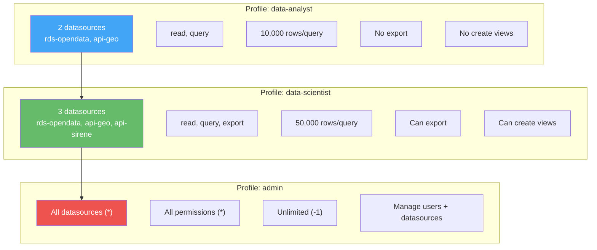

> **Remark — Table Access Control:** The Analyst sees 3 base tables. The Scientist sees the same 3 plus 2 additional derived views (`stats_departement`, `top_entreprises_region`). The Admin has unrestricted access via the wildcard `*`.

> **Remark — Row Limit Enforcement:** `maxRowsPerQuery` is designed to be enforced by Denodo's query governor. The Lambda API returns the limit; Denodo applies it. This decouples policy definition (Lambda) from policy enforcement (Denodo).

### 4.2 Security Tests

```
✓ PASS Request without API key returns 403
✓ PASS Request with invalid API key returns 403
✓ PASS Unknown user returns 200 with guest profile
```

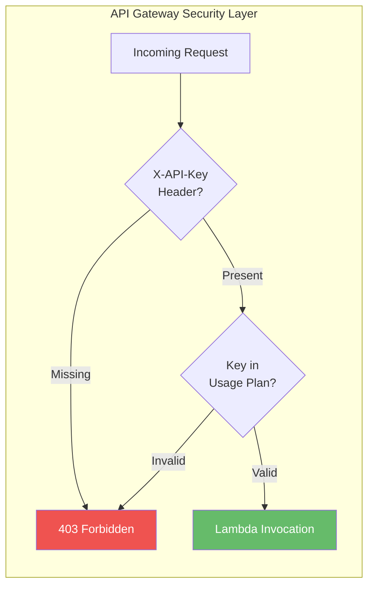

> **Remark:** API key validation is handled at the API Gateway layer, not in Lambda. This means invalid requests never invoke the Lambda function, reducing cost and attack surface. The API key is stored in AWS Secrets Manager (`denodo-poc/api/auth-key`) and rotated independently.

> **Remark — Unknown Users:** An unknown email returns HTTP 200 with a minimal guest profile (no datasources, no permissions). This is a deliberate design choice — the API never reveals whether a user exists. A 404 would leak user enumeration information.

### 4.3 Analyst Permission Scope Validation

```
✓ PASS Analyst has data-analyst profile
✓ PASS Analyst has rds-opendata access
```

These are content-level assertions that verify the response body contains expected strings, ensuring the permission mapping hasn't regressed.

---

## 5. Suite 3: Data Sources Tests

**Purpose:** Validates that the actual data sources referenced in the permission model are accessible and contain data.

### 5.1 Public API Connectivity

```
✓ PASS geo.api.gouv.fr is reachable
✓ PASS geo API returns communes for 75001 (got: 1)
✓ PASS api.insee.fr is reachable (HTTP 404)
```

**Geo API Response (75001 - Paris):**

```json
[
  {
    "nom": "Paris",
    "code": "75056",
    "population": 2103778
  }
]
```

**Geo API Response (69001 - Lyon):**

```json
[
  {
    "nom": "Lyon",
    "code": "69123",
    "population": 519127
  }
]
```

> **Remark:** `geo.api.gouv.fr` is a free, public French government API with no authentication required. The INSEE SIRENE API (`api.insee.fr`) returns HTTP 404 because the full endpoint requires an API token — the test only checks reachability, not data retrieval.

### 5.2 RDS OpenData Connectivity

Data access is tested through SSM (Systems Manager) commands executed on the Denodo EC2 instance, which acts as a bastion to reach the private RDS.

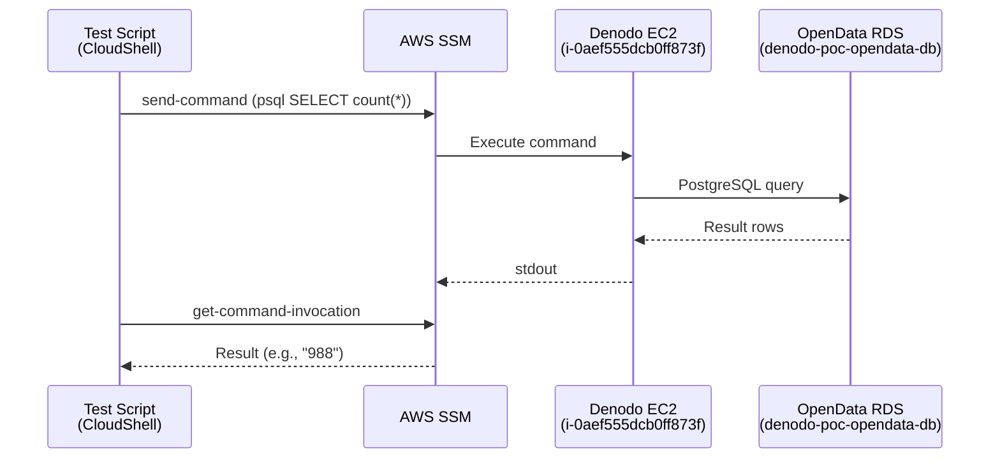

**Tables Validated:**

| Table | Row Count | Description |
|-------|-----------|-------------|
| `entreprises` | 988 | French companies (SIRENE data subset) |
| `population_communes` | 34,969 | All French communes with population data |
| `entreprises_population` | 988 | Join view (entreprises + population by postal code) |

**Sample Data — entreprises:**

| SIREN | Raison Sociale | Ville | Dept |
|-------|---------------|-------|------|
| 100021598 | Entreprise Test 1 | Ville Test | 31 |
| 100030013 | Entreprise Test 2 | Ville Test | 59 |
| 100024933 | Entreprise Test 3 | Ville Test | 75 |
| 100014455 | Entreprise Test 4 | Ville Test | 44 |
| 100007612 | Entreprise Test 5 | Ville Test | 67 |

**Top 5 Communes by Population:**

| Commune | Code Postal | Population |
|---------|------------|------------|
| Paris | 75001 | 2,103,778 |
| Marseille | 13001 | 886,040 |
| Lyon | 69001 | 519,127 |
| Toulouse | 31000 | 514,819 |
| Nice | 06000 | 357,737 |

> **Remark — SSM Access Pattern:** There is no VPN, SSH bastion, or direct database access from outside the VPC. All RDS queries are executed via SSM `send-command` on the Denodo EC2 instance, which has a private IP (10.0.75.195) and the `psql` client installed. This is a zero-trust network architecture.

### 5.3 Denodo EC2 Instance

```
✓ PASS Denodo EC2 instance is running
✓ PASS Denodo EC2 SSM agent is online
```

> **Remark:** The SSM agent status `Online` confirms the EC2 instance can receive remote commands without SSH. This is the same mechanism used by the data sources tests to query RDS.

---

## 6. Permission Model Deep Dive

The authorization architecture separates three concerns:

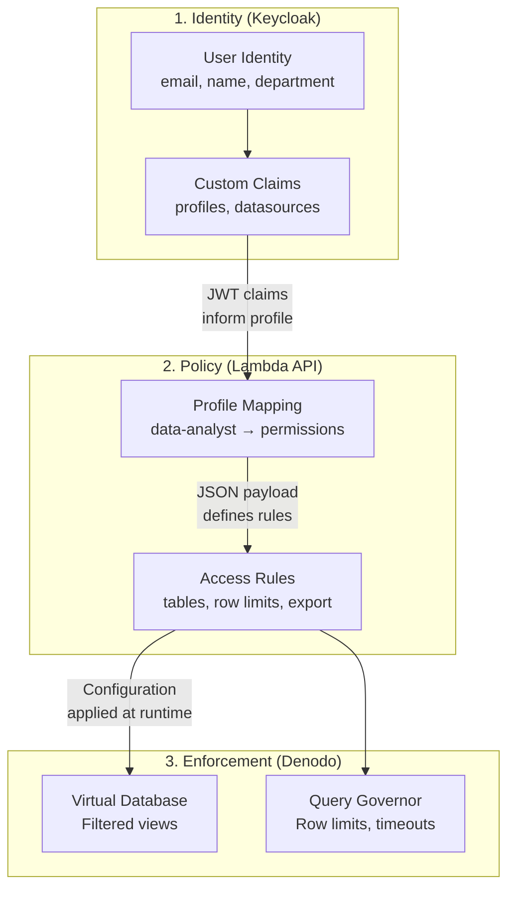

### How the Pieces Connect

1. **User authenticates** → Keycloak issues a JWT with `profiles` and `datasources` custom claims
2. **Application calls Lambda API** → `/users/{email}/permissions` returns the full permission payload
3. **Denodo receives the payload** → Applies table access, row limits, export restrictions at the virtual database layer

### Data Source Access by Profile

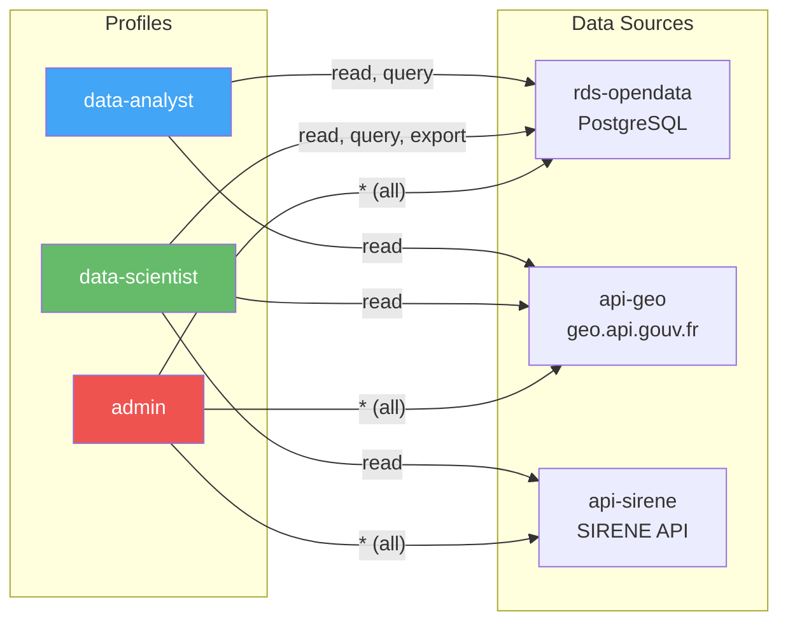

---

## 7. JWT Token Structure Analysis

### Standard OIDC Claims vs Custom Claims

The Keycloak-issued JWT contains both standard OIDC claims and POC-specific custom attributes:

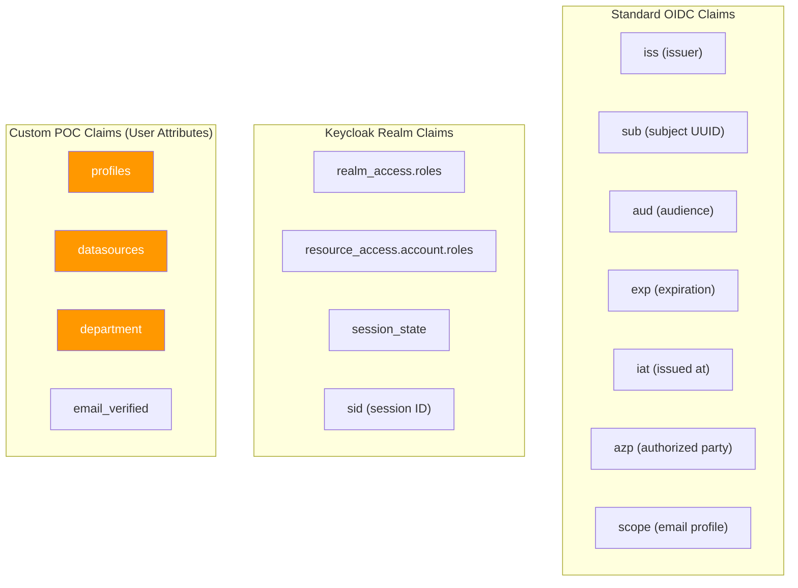

### Analyst JWT Annotated

```json
{
  // ── Standard OIDC ──────────────────────────────────
  "iss": "http://...eu-west-3.elb.amazonaws.com/auth/realms/denodo-idp",
  "aud": "account",              // Token audience
  "sub": "c383de58-...",         // Unique user ID (UUID)
  "azp": "denodo-consumer",      // Client that requested the token
  "exp": 1772144138,             // Expires: 5 minutes from issuance
  "iat": 1772143838,             // Issued at
  "typ": "Bearer",
  "acr": "1",                    // Authentication Context Class

  // ── Keycloak Session ───────────────────────────────
  "session_state": "952d6a19-...",
  "sid": "952d6a19-...",
  "allowed-origins": ["*"],      // CORS origins for this client

  // ── Realm Roles ────────────────────────────────────
  "realm_access": {
    "roles": [
      "default-roles-denodo-idp",
      "offline_access",          // Can request offline tokens
      "uma_authorization"        // User-Managed Access
    ]
  },

  // ── Client Roles ───────────────────────────────────
  "resource_access": {
    "account": {
      "roles": [
        "manage-account",
        "manage-account-links",
        "view-profile"
      ]
    }
  },

  // ── Custom Claims (POC-specific) ───────────────────
  "profiles": ["data-analyst"],           // Authorization profile
  "datasources": ["rds-opendata,api-geo"],// Allowed data sources
  "department": "Analytics",              // Organizational unit

  // ── Standard Identity ──────────────────────────────
  "name": "Data Analyst",
  "given_name": "Data",
  "family_name": "Analyst",
  "preferred_username": "analyst@denodo.com",
  "email": "analyst@denodo.com",
  "email_verified": true
}
```

> **Remark — Token Signing:** All tokens are signed with RS256 (RSA 2048-bit + SHA-256). The public key is available at the JWKS endpoint for verification. Keycloak supports 12 signing algorithms (RS256, RS384, RS512, ES256, ES384, ES512, PS256, PS384, PS512, HS256, HS384, HS512).

> **Remark — Custom Claims as Strings:** The `datasources` claim is stored as a single comma-separated string `["rds-opendata,api-geo"]` rather than a proper array `["rds-opendata", "api-geo"]`. This is a Keycloak User Attribute limitation — multi-valued attributes are stored as individual entries, but the protocol mapper serializes them as a single string. The Lambda API handles the parsing.

---

## 8. Security Validation

### Defense Layers

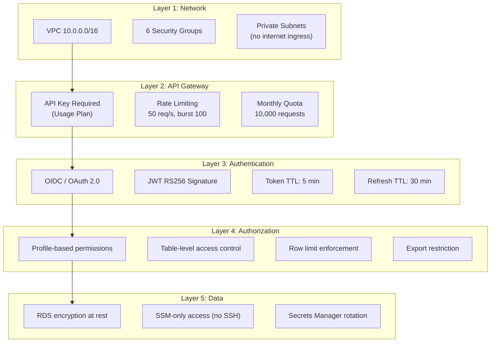

### Tests That Validate Security

| Test | What It Proves |
|------|---------------|
| Missing API key → 403 | API Gateway rejects unauthenticated requests before Lambda invocation |
| Invalid API key → 403 | API Gateway validates against the usage plan, not just presence |
| Unknown user → 200 (guest) | No user enumeration via error codes |
| Per-user permissions differ | Authorization is identity-aware, not one-size-fits-all |
| Admin has `canManageUsers: true` | Elevated privileges are explicitly granted, not implicit |

---

## 9. Remarks and Observations

### Architecture Decisions

1. **Single Keycloak instance, 3 realms:** The deployed architecture uses one ECS task hosting `master`, `denodo-idp`, and `denodo-consumer` realms. This reduces cost and complexity while maintaining logical separation. Production would split these into separate instances for fault isolation.

2. **SSM over SSH/VPN:** All EC2 access is via AWS Systems Manager, eliminating SSH key management and VPN infrastructure. This is a zero-trust approach where identity is verified by IAM, not by network position.

3. **Lambda for permissions (not Keycloak):** Permission rules are externalized in a Lambda function rather than encoded in Keycloak roles. This allows Denodo-specific permission attributes (`maxRowsPerQuery`, `tables`, `canExport`) that don't map to OIDC scopes.

4. **API Gateway as security proxy:** The API key requirement at the gateway level ensures Lambda is never invoked for unauthorized requests, reducing cost (no Lambda cold starts for rejected calls).

### Data Observations

- **988 entreprises** is a subset of the full SIRENE database (11M+ companies). Production would use the full dataset via the SIRENE bulk download or API.
- **34,969 communes** covers all French municipalities with population data from INSEE.
- The `entreprises_population` view is a SQL join that enriches company data with population statistics by postal code — this is exactly the kind of data virtualization Denodo excels at.

### Production Considerations

| Current (POC) | Production Recommendation |
|---------------|--------------------------|
| HTTP (ALB) | HTTPS with ACM certificate |
| Single AZ | Multi-AZ RDS and ECS |
| API key auth | OAuth 2.0 + API key |
| 1 Keycloak instance | 2+ instances (HA) |
| No WAF | AWS WAF on ALB and API Gateway |
| CloudWatch basic | CloudWatch alarms + SNS notifications |
| No backup policy | Automated RDS snapshots + cross-region |

---

## Appendix: Full Test Run Summary

```
╔════════════════════════════════════════════════════════════╗
║     OVERALL TEST RESULTS                                  ║
╚════════════════════════════════════════════════════════════╝

  Test Suites: 3 total
    ✓ 3 passed

  ╔══════════════════════════════════════╗
  ║  ✓ ALL TEST SUITES PASSED            ║
  ╚══════════════════════════════════════╝

  Suite 1: Authentication    — 14 passed, 0 failed
  Suite 2: Authorization API — 17 passed, 0 failed
  Suite 3: Data Sources      — 8 passed, 0 failed
  ─────────────────────────────────────────────
  Total:                       39 passed, 0 failed
```

---

**Document Version:** 1.0
**Last Updated:** 26 February 2026
**Maintainer:** Jaafar Benabderrazak
